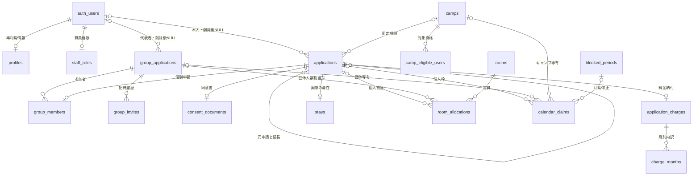

# ひらいずみ志業ポータル データベース設計書

> 平泉町志業シェアハウス利用申請・管理システム

| 項目 | 内容 |
|---|---|
| 文書版 | 1.0 |
| 作成日 | 2026年9月9日 |
| 対象 | 自主制作の試作版 |
| DB | Supabase Database（PostgreSQL） |
| 認証・添付 | Supabase Auth / 非公開Supabase Storage |
| 上位資料 | [要件定義書](./requirements.md)、[ルーティング設計書](./routes.md) |
| 成果物の範囲 | 全利用区分の目標設計。実装・適用済みの範囲は下記と [tasks.md](tasks.md) を参照 |

2026年9月11日現在、SQL 001〜014はSupabase適用済み。014適用後の単一接続916項目・別接続60ケースと全4種類の後片付けはユーザー確認済み。詳細は [tasks.md 第4.8節](tasks.md#48-t12地域活動個人の部屋割当許可sql-014) を参照。013適用後は、ローカル・Supabaseとも単一接続558項目（T10の230＋カレンダー110＋キャンプ218）・別接続40ケース（T10の20＋キャンプ7＋カレンダー13）が成功し、全テスト用スキーマと架空データの後片付けも完了。Supabaseの適用・集約結果・3つの `cleanup_completed = true` はユーザー確認に基づく。SQL 012時点の結果は [tasks.md 第4.6節](tasks.md#46-t09日程管理バックエンドの検証と引き渡しsql-012)、013適用後の確認根拠は [第4.7節](tasks.md#47-t10地域活動個人の実装と検証sql-013) を参照。画面接続・実ログイン・実Storageの受入確認は未実施。

SQL 012時点の日程枠はキャンプ・利用停止のみ。SQL 013で地域活動個人の申請・個人枠・最小審査を追加し、ローカル検証済み（Supabase適用成功をユーザー確認済み）。`room_allocations` は1申請1部屋1人のまま。SQL 014で地域活動個人の割当／許可APIを追加しローカル検証済み（Supabase適用・DB検証・後片付け完了、5.5節）。以下の団体の表・自動処理などは目標設計であり、実装済みとは限らない。013の範囲は5.3節、検証は [tasks.md 第4.7節](tasks.md#47-t10地域活動個人の実装と検証sql-013) を参照。

## 1. 設計の考え方

ログイン情報、繰り返し使うプロフィール、提出した申請を分ける。プロフィールを変更・削除しても、申請時点の内容と町の管理記録は残す。

個別申請を `applications`、団体全体を `group_applications` に保存する。団体の宿泊者も1人につき1件の個別申請を持つ。宿泊しない代表者には個別申請を作らない。

申請状態、納付状態、滞在状態は別々に管理する。料金未納による自動キャンセルは行わない。許可期間とカレンダー上で確保する期間も分け、早期退去しても元の許可内容と料金は変更しない。

この文書でいう「RPC」は、複数のテーブルをひとまとまりのトランザクションで更新するDB関数である。定員確認だけを先に行い、別の通信で申請を保存する方法は採用しない。

## 2. 共通の記法と規則

- PK：主キー。FK：外部キー。UQ：重複を禁止する一意制約。
- 特記しないテーブルは `id uuid PK`、`created_at timestamptz NOT NULL`、`updated_at timestamptz NOT NULL` を持つ。IDと日時はDBで生成する。
- 表の「必須」はNOT NULL。「任意」はNULL可。下書きで任意でも、提出時に必須となる列は別途検査する。
- 日程は `date`、操作・締切時刻は `timestamptz`。日本時間の暦日で業務判定し、日時は画面表示時に日本時間へ変換する。
- 期間は開始日・終了日をともに含む。範囲演算では `[開始日, 終了日+1日)` として扱う。
- 金額は円単位の `integer`。浮動小数点は使わない。
- 状態は `text` とCHECK制約で許容値を限定する。日本語表示はアプリ側で対応付ける。
- 更新には取得時の `updated_at` を渡す。DBが現在値と比較し、不一致なら変更せず競合を返す。親に関連する変更でも親の日時を更新する。日時の精度をクライアントで丸めない。
- 管理記録間のFKは原則 `ON DELETE RESTRICT`。履歴を伴う申請や団体を物理削除せず、状態で終了させる。
- `auth.users` へのFKは、プロフィールと職員権限のみ `ON DELETE CASCADE`、保存対象の業務記録は `ON DELETE SET NULL`。メール一致による再紐付けを禁止する。

## 3. テーブル一覧

業務の主要テーブルに、同時更新・採番・自動処理を支える管理テーブルを加える。

| テーブル | 役割・分ける理由 |
|---|---|
| `profiles` | 再利用する本人情報とアカウントの利用状態 |
| `staff_roles` | Supabase管理側だけで付与する職員権限 |
| `camps` | 固定のキャンプ日程と申請期限 |
| `camp_eligible_users` | キャンプごとの対象メール。将来の別キャンプ登録を分離 |
| `blocked_periods` | 利用停止日程と内部理由 |
| `applications` | 全利用区分の個別申請と申請時点の本人情報 |
| `group_applications` | 団体の共通情報、代表者情報の写し、期限 |
| `group_members` | 団体と個別申請の対応、参加・削除履歴 |
| `group_invites` | 共通招待の照合情報と失効状態 |
| `rooms` | 8部屋の名称と定員 |
| `room_allocations` | 個人または団体に割り当てた部屋・人数・日程 |
| `consent_documents` | 同意書の非公開保存先と検証済みファイル情報 |
| `application_charges` | 個別申請の料金合計、納付期限・状態 |
| `charge_months` | 月上限を適用した料金内訳 |
| `stays` | 実際の入居・退去の記録 |
| `calendar_claims` | 日程を占有する根拠。許可期間と枠解放を分離 |
| `application_status_events` | 本人にも開示できる個別申請の状態履歴 |
| `group_status_events` | 団体として開示できる状態履歴 |
| `audit_logs` | 変更前後を含む職員専用の監査記録 |
| `staff_notes` | 利用者へ開示しない内部メモ |
| `contact_settings` | 町の緊急連絡先 |
| `reception_counters` | 年度ごとの共通連番 |
| `reception_numbers` | 個別申請・団体を横断する受付番号の一意性 |
| `account_cleanup_jobs` | 認証アカウント初期化の再試行管理 |
| `facility_guard` | 定員・日程更新を直列化する1行のロック対象 |

`auth.users` と `storage.objects` はSupabase管理テーブルとして利用し、独自に作成・直接変更しない。

## 4. 主な関係（ER図）

読みやすさのため、履歴・採番・設定・ロック用テーブルは省略する。`auth_users` は `auth.users` の表記上の別名。

## 5. カラム定義

### 5.1 認証・プロフィール

**profiles** — Auth削除に連動して削除する再利用情報。

| カラム | 型・必須 | 制約・用途 |
|---|---|---|
| `id` | uuid・必須 | PK、FK → auth.users.id。共通IDの例外 |
| `full_name`, `address`, `phone` | text・任意 | プロフィール未入力での登録を許容 |
| `emergency_name`, `emergency_address`, `emergency_phone` | text・任意 | 個人の緊急連絡先 |
| `account_state` | text・必須 | `active / cleanup_pending / disabled`、初期値active。本人は変更不可 |

メール・パスワード・職員フラグはプロフィールに置かない。申請メールは提出時の写しとして別途保存する。

**staff_roles** — `user_id uuid PK FK → auth.users.id`、`created_at timestamptz` のみ。一般利用者と通常の職員画面にはINSERT/UPDATE/DELETE権限を付与しない。本人は自分が職員であるかだけを確認できる。

### 5.2 キャンプ・利用停止

**camps**

| カラム | 型・必須 | 制約・用途 |
|---|---|---|
| `name` | text・必須 | 空白のみ不可 |
| `start_date`, `end_date` | date・必須 | 開始≦終了。地域活動の最大15日制限は適用しない |
| `application_deadline` | timestamptz・必須 | DB時刻で新規提出可能か判定 |
| `deleted_at` | timestamptz・任意 | 画面の削除は論理削除。既存申請を保持 |
| `created_by` | uuid・任意 | FK → auth.users.id |

**camp_eligible_users** — `camp_id uuid FK → camps.id`、`email_normalized text` は必須。`disabled_at timestamptz` は任意。UQ `(camp_id, email_normalized)`。メールは前後空白除去・小文字化で統一し、Authのメールと同じ正規化で照合する。別キャンプでは同じメールを登録できる。無効化しても提出済み申請は消さない。

**A1の対象者ID・参加状態基盤（SQL 030・ローカル検証済み／Supabase未適用）**

SQL 030は既存の `camp_eligible_users.id` を対象者の安定IDとして再利用する。IDを作り直さず、既存の `(camp_id,email_normalized)` に加えて複合参照用のUQ `(camp_id,id)` を持つ。既存対象者の管理用氏名はNULLのまま許容し、新規登録時の必須検査はA2の登録RPCで行う。

| 追加先 | 追加列 | 用途 |
|---|---|---|
| `camp_eligible_users` | `management_name` | 職員の管理用氏名。既存行はNULL可 |
| 同上 | `participation_status / released_at / release_reason` | 資格の有効・無効とは別の今回参加状態 `participating / released` と終了根拠 |
| 同上 | `linked_user_id / linked_at / linked_email_normalized` | 最初の申請作成時に確定する本人結合。AuthへのFKを付けず、Auth削除後も結合済み事実を保持 |
| `applications` | `camp_eligible_user_id` | `(camp_id,camp_eligible_user_id)` から対象者を複合参照。地域活動では常にNULL |
| 同上 | `input_version` | 新方式campの本人入力変更を単調増加で識別 |
| `camps` | `room_assignment_mode` | `legacy_application / eligible_roster`。既存行と現行新規作成経路はlegacy |
| 同上 | `roster_version / room_plan_version / saved_roster_version / roster_label_version / room_plan_committed_at` | 後続の名簿・部屋案の版整合に使う基盤。A1では部屋案を保存しない |

`applications_one_active_camp_per_eligible_user` は同じcamp・対象者IDについて `status NOT IN ('rejected','cancelled')` を1件に制限する。既存の利用者単位制約も残す。共通の申請状態CHECKは `cancellation_requested` を含む8状態のまま変更しない。

`eligible_roster` の初回下書きだけ、現在の確認済みAuthメールと未結合の有効対象者を照合し、対象者行をロックして `linked_user_id` を確定する。結合後は対象者IDと `applications.user_id` を使い、メール変更では所有者を変更しない。結合済みUUIDは変更不可であり、Auth削除後に同じメールで作られた別UUIDへ自動再結合しない。`legacy_application` の閲覧・下書き・提出は従来のメール照合を維持する。

camp限定の遅延整合性トリガーは、新方式の有効申請に対象者リンクを必須とし、対象者のcamp所属・参加中・非無効・結合所有者と申請所有者を検査する。地域活動個人・団体の行には新しいリンクを許可しない。モード変更はA1では行わず、将来の専用移行RPCがトランザクション内のガードを設定した場合だけ許可する。

`get_staff_camp_roster(uuid)` はactive職員だけに、campのモード・版と安定ID基準の対象者／関連申請を返す読取専用RPCである。`diagnose_camp_roster_migration(uuid)` は既存申請を `auto_link_candidate / conditional_link_candidate / staff_review / legacy_only` に分類し、根拠コードとcamp単位の切替阻害理由を返す。診断は対象者リンク、既存申請、部屋、滞在、モードを更新せず、自動補正もしない。

**A2の対象者単件管理（SQL 031）**

`create_camp_roster_eligible_user` と `update_camp_roster_eligible_user` はactive職員・`eligible_roster` のcampだけを対象にする。ロック順は施設／職員→camp→安定対象者IDであり、作成時はcampロックで同campの同メール登録を直列化する。重複は有効・無効・参加終了・Auth結合の状態を返さず `eligible-email-exists` に統一する。新規は管理用氏名1〜200文字と正規化メールを必須とし、更新は対象者の`updated_at`を期待版として必須にする。結合済み対象者のメール変更だけは理由も必須であり、`linked_user_id`等は変更しない。監査には作成／変更だけを残し、profiles、申請の氏名写し、地域活動のデータは変更しない。旧一括登録・変更・無効化RPCは`legacy_application`専用へ限定する。

ローカルPostgreSQL 18.4でSQL 001〜030の連続適用、A1の単体16チェックと並行2ケース、既存DB単体・並行回帰を確認済み。外部Supabaseには適用していない。

**blocked_periods** — `start_date date`、`end_date date`、`internal_reason text` は必須。開始≦終了。`created_by uuid FK → auth.users.id`、`deleted_at timestamptz` は任意。60日制限なし。内部理由を公開カレンダーに渡さない。

### 5.3 個別申請

**applications**

| カラム | 型・必須 | 制約・用途 |
|---|---|---|
| `user_id` | uuid・任意 | FK → auth.users.id。作成時は認証本人、削除時だけNULL化 |
| `usage_type` | text・必須 | `camp / community_individual / community_group` |
| `camp_id` | uuid・任意 | FK → camps.id。campの場合だけ必須 |
| `group_id` | uuid・任意 | FK → group_applications.id。community_groupの場合だけ必須 |
| `original_application_id` | uuid・任意 | FK → applications.id。延長元。自分自身への参照不可 |
| `status` | text・必須 | 第6章の個別申請状態。初期値draft |
| `start_date`, `end_date` | date・任意 | 下書きで未設定可。両方設定時は開始≦終了 |
| `user_name`, `user_address`, `user_phone`, `email_snapshot` | text・任意 | 提出時必須の本人情報の写し |
| `emergency_name`, `emergency_address`, `emergency_phone` | text・任意 | 提出時必須。代表者へ返さない |
| `usage_place` | text・任意 | 提出時は `common_and_second_floor` のみ |
| `purpose`, `local_activity`, `special_notes` | text・任意 | 目的は提出時必須。地域活動では町内活動も必須。特記事項は任意 |
| `requires_guardian_consent` | boolean・任意 | 提出時必須。未成年または18歳高校生に該当すればtrue |
| `room_preference` | text・任意 | camp提出時は `shared_ok / private_requested`。他区分はNULL |
| `extension_reason` | text・任意 | 延長申請の提出時必須 |
| `submitted_at`, `last_submitted_at` | timestamptz・任意 | 初回提出日時を保持。再提出は後者だけ更新 |
| `revision_due_at` | timestamptz・任意 | 個別の修正期限。団体の場合は団体の期限も検査 |
| `decision_reason`, `approval_comment`, `cancel_reason` | text・任意 | 不許可・修正理由、任意許可コメント、キャンセル理由 |

区分とcamp/groupの組み合わせをCHECKで固定する。個人・キャンプは本人を申請者兼使用者とし、同じ氏名・住所を二重保存しない。団体参加者の申請者は団体共通情報の代表者となる。

提出済みの写しをプロフィール同期で更新しない。修正依頼で変更する場合は、更新前後を監査履歴に保存する。団体参加者の日程・目的は団体情報を正とし、参加者による個別変更を禁止する。共通情報の修正はDB関数で関連申請・料金・枠を同時更新する。すでに個別許可がある状態で許可内容が変わる修正は職員による再審査を必要とし、過去の内容は監査履歴に残す。

**T10の実装範囲（SQL 013・Supabase適用済み）**

SQL 013では `usage_type` を `camp / community_individual` に限定し、団体の値・`group_id` は追加しない。campは `camp_id` 必須、community_individualは `camp_id / room_preference` がNULL。新規下書きのUUIDは明示保存前に用意してRPCへ渡し、同一UUIDの再送は既存の本人行を返す。表示目的のGETで下書きを作らない。

| 追加列 | 目的 |
|---|---|
| `revision_start_date / revision_end_date` | 修正保存中の候補日程。元の提出日程と枠は再提出成功まで維持。個人だけに使用 |
| `last_submission_key` | 直近の成功した提出操作を識別するUUID |
| `last_submission_version` | その提出が受け付けた更新日時。同一キー・同一版の通信再送は番号・料金・履歴を再作成しない |

個人の日程は両方未入力または実在する2〜15日。修正候補も両方未設定または同じ構造条件。開始14日後以降・終了60日以内は初回提出と日程変更再提出で、ロック取得後のJST現在日を用いて検査する。職員指定の修正期限は任意で、団体の標準期限・自動取消は適用しない。下書き保存は受付窓・満員でも入力を保持できる。

作成・保存・提出・添付差替・最小審査は施設ロックを共有し、activeな本人または職員を待機後も確認する。申請行と関連行をロックし、保存・提出・添付・審査に元の `updated_at` を要求する。初回採番は関連更新の後に共通カウンターを更新する。40001／40P01は自動再送せず、古い画面として返す。SQL 012までのキャンプ保存／添付RPCにも区分検査を加え、個人を更新日時なしで更新する迂回を防ぐ（旧ファイル・引数は変更しない）。

| 公開RPC | 入力・責務 |
|---|---|
| `create_community_application_draft` | UUID、任意の `draft_fields jsonb`。プロフィール初期値・本人固定・下書き作成 |
| `save_community_application_draft` | UUID、元の更新日時、編集可能な全項目のJSON。下書き／修正依頼だけ保存 |
| `submit_community_application` | UUID、元の更新日時、提出キーUUID、確認同意true。必須・同意書・日程・日別定員を再検査し、枠・料金・採番・提出履歴を一括確定 |
| `review_community_application` | UUID、`start_review / request_revision / reject`、元の更新日時、理由、任意修正期限。active職員だけ |
| `get_community_application` | UUID。active本人だけの読取専用JSON。確認時の問題も返し、業務更新しない |
| `register_community_guardian_consent_document` | UUID、想定所有者・更新日時、パス・MIME・サイズ。サービス権限だけ。本人・状態を再確認し親の版を進める |

通常RPCはauthenticatedのみ実行可で、内部ヘルパーは利用者・anon・service_roleから直接実行できない。個人情報の本人／職員RLS、職員専用監査の分離を維持する。利用者の直接INSERT／UPDATE／DELETE権限は追加しない。

個人枠は `calendar_claims.claim_type = individual` とUQの `application_id`（FK RESTRICT）で1申請1行。キャンプ・停止・個人の参照先はCHECKで一つに限定する。submitted／under_review／revision_requested／approved／cancellation_requestedを有効に数え、拒否・取消の終了状態は解放する。取消への操作はT17で実装予定。日程変更再提出では同じ行を新期間に置き換える。

定員は個人の各日を1人と数え、`released_from` 当日以降を除く。個人同士は各日15人まで共存でき、キャンプ・停止との重複は端点を含めて拒否する。個人の枠が欠落しても元申請を数え、書込時は枠の日程不整合を拒否する。職員のキャンプ・停止編集にも `camp_id IS NULL` の個人を含める。公開応答は日付・可否だけ、職員月はindividual行、職員日は既存application行（camp_idがNULL）として返す。

料金は初回と日程変更再提出だけ更新し、同日程なら確定額・内訳を維持する。日程変更でも納付状態・納付期限は維持する。番号と初回提出日時は再提出で変えず、最終提出日時を更新する。申請・枠・部屋行（存在時）・料金・月別内訳・添付の前後を職員監査に残す。提出済みの旧同意書は差替後も削除せず、当時のパスを監査に残す。下書きだけの旧ファイルはDBが `delete_previous` を許した場合に既存Storage Actionで削除する。

### 5.4 団体・参加者・招待

**group_applications**

| カラム | 型・必須 | 制約・用途 |
|---|---|---|
| `representative_user_id` | uuid・任意 | FK → auth.users.id。作成時必須、削除後NULL |
| `group_name` | text・任意 | 提出時必須 |
| `representative_name`, `representative_address`, `representative_phone`, `representative_email` | text・任意 | 代表者の写し。提出時必須、参加者向け共通取得には含めない |
| `start_date`, `end_date` | date・任意 | 提出時必須、地域活動の期間条件を検査 |
| `usage_place`, `purpose`, `local_activity`, `special_notes` | text・任意 | 提出時に特記事項以外必須 |
| `planned_participants` | integer・任意 | 設定時2〜15。新規提出時必須。許可後の実人数は参加者から算出 |
| `status` | text・必須 | 第6章の団体状態、初期値draft |
| `submitted_at` | timestamptz・任意 | 初回の日程確保日時 |
| `participant_due_at`, `revision_due_at` | timestamptz・任意 | 初回提出期限、修正期限 |
| `purpose_reviewed_at` | timestamptz・任意 | 職員による団体目的の確認。目的修正時は解除 |
| `decision_reason`, `approval_comment`, `cancel_reason` | text・任意 | 団体へ開示する理由・コメント |
| `status_before_cancellation` | text・任意 | キャンセル申請前の状態。cancellation_requested時必須。元のcollecting/revision_requestedの期限判定に使用 |
| `completed_at` | timestamptz・任意 | 不許可・キャンセル、または全有効参加者の退去で団体終了 |

参加人数、提出人数、納付済み人数、見込合計額は集計で求め、団体列へ重複保存しない。宿泊代表者も `group_members` へ登録する。

**group_members** — `group_id uuid FK → group_applications.id`、`application_id uuid FK → applications.id UQ`、`state text (active / removed)` は必須。`removed_at timestamptz`、`removal_reason text` は任意。参加者本人はapplications.user_idから判定し、user_idを重複保持しない。

DB関数と制約トリガーで `applications.group_id = group_members.group_id`、区分community_groupを保証する。同じ団体・同じ利用者のactive参加は1件。代表者が削除する場合は物理削除せず、未終了個別申請をキャンセルし、提出内容と受付番号を保持する。不許可の人を削除する場合は不許可記録を維持する。交代者は別の個別申請を持つ。

**group_invites**

| カラム | 型・必須 | 制約・用途 |
|---|---|---|
| `group_id` | uuid・必須 | FK → group_applications.id |
| `token_hash`, `code_hash` | text・必須 | 各UQ。生のリンクトークン・コードは保存しない |
| `revoked_at` | timestamptz・任意 | 無効化日時 |
| `created_by` | uuid・任意 | FK → auth.users.id |

`group_id WHERE revoked_at IS NULL` の部分UQで、有効候補を団体ごとに1件へ制限する。有効期限は団体の現在の提出期限、修正中は修正期限を参照する。期限を別列に複製しない。再発行は旧行失効と新行作成を同一トランザクションで行う。生の値は発行時だけ代表者へ提示し、再表示が必要なら再発行する。

試作版ではリンクを暗号学的乱数32バイト以上、手入力コードを紛らわしい文字を除くランダム英数字16文字とする。照合は試行回数を制限したサーバー入口を経由する。認証前の返却は有効・無効等の案内だけ。招待情報のテーブルSELECTは利用者へ許可しない。

### 5.5 部屋と部屋割り

**rooms** — `name text UQ`、`capacity integer CHECK (capacity BETWEEN 1 AND 3)` は必須。固定マスターとして次を登録し、通常画面から更新しない。

| 桐 | 藤 | 梅 | 竹 | 松 | あやめ | もみぢ | さくら |
|---|---|---|---|---|---|---|---|
| 1 | 1 | 2 | 2 | 2 | 2 | 2 | 3 |

**room_allocations** — `room_id uuid FK → rooms.id`、`people_count integer > 0`、`start_date date`、`end_date date` は必須。`application_id uuid FK → applications.id` と `group_id uuid FK → group_applications.id` は任意だが、必ず片方だけを設定する。`released_from date` は任意。開始≦終了。

個人割当はcamp/community_individualだけを対象に人数1。団体割当は部屋ごとの人数を記録し、参加者名を紐付けない。各日の個人割当は合計1、団体割当は各日のactive参加人数と一致することを許可時に検査する。部屋別合計≦各定員、施設合計≦15を割当の保存時にも検査する。早期退去後の割当解放は `released_from` 以降に適用し、履歴は残す。

**T12地域活動個人の実装（SQL 014・Supabase適用・DB検証・後片付け完了）**

新しいテーブルは作らず、SQL 002の `application_id UNIQUE / people_count=1` を使う。通常の地域活動個人だけを対象にし、`original_application_id IS NOT NULL`、camp、団体は新RPCで受け付けない。適用済み001〜013を書き換えず、014で必要な関数を追加・置換する。

| RPC／内部処理 | 契約 |
|---|---|
| `assign_community_application_room(uuid,uuid,timestamptz,text)` | 申請ID・部屋ID・親の元更新日時・変更理由。審査中／許可に限り、1人・提出済み期間全体を保存。返却は `result_id / result_status / result_updated_at` |
| `review_community_application(uuid,text,timestamptz,text,timestamptz)` | 013の引数・返却を維持し `approve` を追加。既存の審査開始・修正依頼・不許可も同じ入口。許可コメントは任意、修正期限は修正依頼時だけ |
| `get_staff_community_application_room_context(uuid)` | active職員限定、1つの読取スナップショットで申請の版・期間・状態・部屋・滞在・8部屋マスターを返す。割当の空き保証や自動修復はしない |
| `get_community_application(uuid)` | 013の本人限定取得へ `approval_comment / room_allocation / stay` を追加。内部監査、変更理由、職員IDは返さない |
| `private.community_snapshot` | 従来の申請・枠・部屋・料金・添付に `stay` を追加。過去の監査は書き換えず、以後の監査へ反映 |

全更新は `private.lock_calendar_for_staff()` で施設ガードを実UPDATEし、待機後の職員権限・activeプロフィールを共有ロックして再検査する。その後、親申請→割当・滞在等をロックする。親の更新日時はマイクロ秒まで一致させ、割当変更も単調増加トリガーで親の版を進める。REPEATABLE READの古いスナップショットは40001で拒否する。通常クライアントの直接書込みは禁止。公開RPCはauthenticatedのみ実行可で、さらにDB内でactive職員を検査する（本人取得だけはactive本人）。内部ヘルパーはanon・authenticated・service_roleへ直接実行を許可しない。

部屋・施設の検査は開始・終了を含む全日で実施する。提出済み個人枠を1人として維持し、部屋割当で2人目を加算しない。部屋未割当・修正依頼中等も施設人数に含める。本人の旧割当は除外して新候補を1人加算する。キャンプ・停止の元データと枠、同一利用者重複、対象個人枠の日程一致・未解放も再検査する。枠欠落や不整合は空きと扱わず拒否する。施設超過は既存 `capacity-full`、追加の防御検査は `facility-capacity-full`、部屋超過は `room-capacity-full`。

初回割当の理由は任意。既存割当変更は2,000文字以内の理由必須。最新の版で同じ有効な部屋・全期間なら親・割当・監査を更新しない。日程変更再提出は013の動作を維持し、旧割当を `released_from=start_date` で全解放する。審査中に理由付きで再割当すると同じ行の期間・部屋を更新し解放を解除する。部分解放や未解放の期間不一致を自動修復しない。監査操作は `assign_room / change_room / reassign_room`。変更理由は公開状態履歴へ転記しない。

許可は審査中だけ。部屋1人・全期間・未解放、施設枠・定員・日程競合に加え、提出済み必須情報、申請メールの写し、必要な同意書メタデータ、提出日時、受付番号、料金と月別内訳合計の一致を確認する。初回受付窓を再適用しない。既存滞在があれば拒否し、初回成功時だけ `before_move_in`（入退去日時NULL）を作る。申請・滞在・公開状態履歴・監査が同じトランザクションで確定する。許可コメントは任意で2,000文字以内。納付済みを条件にせず、番号・料金・納付情報は変更しない。

許可後の部屋変更は入居前・滞在中だけ。退去済み・滞在欠落・解放済みの許可割当は拒否する。利用期間全体の割当を変更し、前後内容は監査へ残す。日単位の部屋分割や入退去の操作は追加しない。修正依頼は枠・部屋を保持、不許可は両方を全解放する。失敗時は状態・版・部屋・滞在・枠・履歴の全変更を取り消す。

本人／職員の部屋応答は `room_id / room_name / people_count / start_date / end_date / released_from / is_current`、滞在は `status / checked_in_at / checked_out_at`。割当なしはnull、解放済みの旧行は `is_current=false` として返す。取得では状態変更・枠修復・監査追加をしない。

### 5.6 同意書

**consent_documents** — `application_id uuid UQ FK → applications.id`、`object_path text UQ`、`mime_type text`、`size_bytes integer` は必須。MIMEは `application/pdf / image/jpeg / image/png`、サイズは1〜5,242,880バイト（試作版の5MBは5MiBと定義）。

バケット名は `guardian-consents`、非公開。パスは `applications/{applicationId}/{randomId}` とし、メール・氏名を含めない。公開URL・署名付きURLはDBに保存しない。必須該当者は添付検証完了まで提出不可。

アップロードはServer Actionで本人・編集可能状態を検証後、サーバーの管理用クライアントで保存する。利用者自身をStorageオブジェクトの所有者にしない。Auth削除後も同意書を職員向け記録として保持するためである。Storageでは、所有オブジェクトがあるユーザーの削除ができない制約がある。[Supabase公式資料](https://supabase.com/docs/guides/auth/managing-user-data)

DBとStorageは同じトランザクションにならない。新しいランダムパスへアップロード→DBで所有者・状態・競合を再検査してパスを確定→失敗した新規ファイルを削除、という順で処理する。提出済み内容に属する旧版ファイルは監査記録にパスを残して保持する。未提出下書きの旧版・未参照アップロードは清掃対象とする。旧版参照も本人または職員の認可を通す。参照リンクは認可後に短時間（例：60秒）だけ発行する。

### 5.7 料金と滞在

**application_charges**

| カラム | 型・必須 | 制約・用途 |
|---|---|---|
| `application_id` | uuid・必須 | UQ、FK → applications.id |
| `total_amount` | integer・必須 | 0以上、月別内訳の合計 |
| `payment_status` | text・必須 | `unpaid / paid`、初期値unpaid |
| `payment_due_date` | date・任意 | 職員設定。翌日から未納なら期限超過表示 |
| `paid_at` | timestamptz・任意 | paid時必須、未納へ戻す場合は理由と履歴を記録 |
| `calculated_at` | timestamptz・必須 | 計算日時 |

**charge_months** — `charge_id uuid FK → application_charges.id`、`month date`（各月1日）、`usage_days integer > 0`、`daily_rate integer = 300`、`monthly_cap integer = 9000`、`amount integer >= 0` は必須。UQ `(charge_id, month)`。単価・上限は計算時点の写しとして残す。`amount = least(usage_days * daily_rate, monthly_cap)` をCHECKで保証する。

下書きは見込計算のみ、初回提出で料金行を作成する。許可前の日程修正時は履歴を残して再計算する。許可後の早期退去・キャンセルで自動減額しない。職員の通常更新は納付情報を対象とし、任意の料金上書きは提供しない。

**stays** — `application_id uuid UQ FK → applications.id`、`status text (before_move_in / staying / moved_out)` は必須。`checked_in_at timestamptz`、`checked_out_at timestamptz` は任意。許可時に行を作成し、それ以前は行なし。before_move_inは両日時NULL、stayingは入居日時だけ、moved_outは両日時必須かつ退去≧入居をCHECKする。

団体参加者は個別許可で行を作成するが、団体全体が許可されるまで入居操作不可。キャンセル済みのbefore_move_in行は保存し、申請状態と組み合わせて終了判定する。

### 5.8 カレンダーの枠

下表は全区分対応後の設計である。SQL 012で追加する列・制約・入口は直後の「T09の実装範囲」を参照する。

**calendar_claims**

| カラム | 型・必須 | 制約・用途 |
|---|---|---|
| `claim_type` | text・必須 | `camp / blocked / individual / group` |
| `camp_id`, `blocked_period_id`, `application_id`, `group_id` | uuid・任意 | それぞれ対応テーブルへのFK。種別に対応した1列だけ必須 |
| `start_date`, `end_date` | date・必須 | 元の確保範囲、開始≦終了 |
| `released_from` | date・任意 | この日以降を解放。全解放は開始日を設定 |

各FKに非NULLの部分UQを設け、対象ごとに枠1行とする。現在の有効範囲は開始日から `min(end_date, released_from - 1日)` まで。範囲が空なら占有なし。

個人枠は1人分、団体・キャンプ・停止枠は排他的な期間。キャンプ参加者自身のcalendar_claims行は作らず、対象キャンプ内の有効個別申請を数えて15人制限を検査する。団体参加者にも個人枠は作らず、団体専有と二重計上しない。

**T09の実装範囲（SQL 012）**

- `blocked_periods` は `id / start_date / end_date / internal_reason / created_by / deleted_at / created_at / updated_at` を持つ。内部理由は空白除去後1〜2000文字。削除は論理削除とする。
- `calendar_claims` の種別は `camp / blocked` のみ。`camp_id / blocked_period_id` は種別に対応する一方だけ必須で、それぞれUQ、FKは `ON DELETE RESTRICT`。`application_id / group_id` はまだ追加しない。日付は0001〜9999年、開始≦終了、解放開始日は開始日〜終了日翌日の範囲に制限する。
- 元のキャンプ・利用停止の登録／更新トリガーが枠を同期する。削除済みは `released_from = start_date` として全解放する。通常クライアントに元データ・枠の直接書込み権限は与えず、業務RPCが先に施設ロックを取得する。管理者による直接SQLはこの業務検査を迂回できるため、通常の登録・編集にはRPCを使う。
- 既存キャンプを削除済み分も含めて移行する。日付範囲・有効キャンプの重複・有効提出済み申請との日程不一致を検査し、不整合ならSQL 012全体を取り消す。既存の申請・部屋・料金を自動修正しない。
- キャンプの個人申請を別枠に数えない。参加者の不許可でもキャンプ枠は維持する。地域活動の個人枠はT10、団体枠はT18以降で制約・参照先とともに追加する。

**T09の更新RPCと権限**

| RPC | 保証する内容 |
|---|---|
| `create_staff_camp` | 既存の引数とUUID返却を維持。日程競合・期限境界を検査し、キャンプ・枠・監査を作る |
| `update_staff_camp` | 対象ID、名称、期間、期限、`expected_updated_at`、変更理由を受け取る。期間変更は有効提出済み申請がない場合だけ。下書きの日程・更新日時と最小限の変更監査を同時更新 |
| `delete_staff_camp` | 対象ID、更新日時、理由が必須。有効提出済み申請がなければ論理削除・枠解放。下書きと履歴は残す |
| `update_camp_eligible_user` | 対象資格ID、キャンプID、新メール、更新日時、理由が必須。既存申請と重なる対象資格や重複メールを拒否し、監査を記録 |
| `disable_camp_eligible_user` | 対象資格ID、キャンプID、更新日時、理由が必須。既存申請がある対象資格を保護し、論理無効化と監査を同時実行 |
| `save_staff_blocked_period` | IDがNULLなら登録、IDありなら編集。期間と内部理由を検査し、編集では更新日時・変更理由も検査 |
| `delete_staff_blocked_period` | 対象ID、更新日時、理由を検査し、論理削除・枠解放 |

作成以外の返却は `result_id / result_updated_at`。編集時は最新の更新日時と完全に同じ内容なら更新・監査追加なし。古い更新日時は同一内容でも `stale-update`。更新日時はSQL 010の単調増加トリガーをキャンプ・利用停止・枠にも適用し、マイクロ秒を保持する。

有効な職員だけが更新可能。施設ロック後に職員権限行・activeプロフィールを共有ロックして再確認し、対象行を更新ロックする。申請の複数行はID順。全影響範囲で他の枠と有効申請を再検査し、競合は `date-conflict`、提出済み申請によるキャンプ変更拒否は `camp-has-applications` とする。職員専用の詳細は種別・ID・氏名／名称・受付番号・期間・状態だけで、住所・連絡先を含めない。元データ・枠・下書き同期・監査は1トランザクションで保存する。

下書き作成、提出、対象メール追加も施設ロックを取得する入口へ更新する。提出時はキャンプの枠・削除状態を再検査し、競合の内部詳細を申請者に返さない。SQL 009・011の現在時刻による期限検査、SQL 010の定員・許可処理は維持する。

**T09の取得RPC**

| RPC | 入力・返却と閲覧権限 |
|---|---|
| `get_public_calendar` | 月初日→月内全日の `date / availability` のみ。anon・authenticatedが実行可。内部表のSELECT権限は不要 |
| `get_staff_calendar` | 月初日→重なる有効キャンプ・利用停止の種別、ID、期間、名称、人数、内部理由、元データの更新日時 |
| `get_staff_calendar_day` | 日付→当日のキャンプ・利用停止と有効個別申請の必要な概要。住所・電話・メール・緊急連絡先は返さない |

公開表示は日本時間の当日を基準に、13日後までを `unavailable`、61日後以降を `not_yet_open`、14〜60日後は有効枠があれば `unavailable`、なければ `available` とする。1回の応答内で基準日を固定し、日単位の案内として使う。申請可能期間全体の検査はT10で実装する。

職員用RPC・新表のSELECTはactive職員のみ。新表はRLSを有効化し、通常クライアントに直接書込みを許可しない。内部関数はクライアントから実行できない。取得処理は状態変更・枠修復・監査追加を行わず、認可や日本時間の日付が古くなる共有キャッシュを追加しない。

### 5.9 状態履歴・内部記録・設定

**application_status_events** — `application_id uuid FK → applications.id`、`to_status text`、`occurred_at timestamptz` は必須。`from_status text`、`public_reason text`、`actor_user_id uuid FK → auth.users.id` は任意。本人と職員向け。利用者向け応答では職員のIDを除く。共通updated_atを持たない追記専用記録とする。

**group_status_events** — 上記の対象を `group_id uuid FK → group_applications.id` に置き換えた団体共通履歴。個人の不許可理由等を転記しない。代表者・active参加者は共通履歴だけを取得できる。

**audit_logs** — `entity_type text`、`entity_id uuid`、`action text`、`before_data jsonb`、`after_data jsonb`、`actor_kind text (user / staff / system)`、`occurred_at timestamptz` は必須。`actor_user_id uuid FK → auth.users.id`、`reason text` は任意。作成・削除時の存在しない側は空オブジェクト。対象が複数テーブルにまたがるためentity_idにFKは付けず、DBの専用処理だけが書く。職員限定、追記専用、共通updated_atなし。部屋変更は理由必須。パスワード、認証トークン、生の招待値は記録しない。

**staff_notes** — `application_id uuid FK → applications.id`、`group_id uuid FK → group_applications.id` の片方だけを指定。`body text` は必須、`author_user_id uuid FK → auth.users.id` は任意。更新履歴はaudit_logsに残す。

**contact_settings** — `id smallint PK CHECK (id = 1)`、`name text`、`phone text`、`service_hours text`、`updated_at timestamptz`。各値必須。町の設定は1行だけ。利用者へは滞在中、または許可後の団体代表者等、画面仕様上必要な条件で返す。

### 5.10 採番・自動処理・ロック

**reception_counters** — `fiscal_year integer PK`、`last_number integer >= 0`、`updated_at timestamptz`。1年度1行。

**reception_numbers** — `fiscal_year integer FK → reception_counters.fiscal_year`、`serial_number integer > 0`、`display_number text UQ` は必須。`application_id uuid UQ FK → applications.id` と `group_id uuid UQ FK → group_applications.id` の片方だけ必須。UQ `(fiscal_year, serial_number)`。個別申請と団体で同じ連番系列を共有する。

下書きでは発行しない。初回提出・団体の申請開始時にカウンター行をロックして増分し、対象へ紐付ける。再提出・二重送信では既存番号を返す。4桁は最小桁数で、10000以降も切り捨てない。

要件の「西暦」と「運用年度ごとの連番」を両立する試作版の仮定として、4月1日始まりの年度を採用する。2027年3月31日の提出は `SG-2026-xxxx`、4月1日は `SG-2027-0001`。暦年リセットを意図する場合は実装前に採番規則だけ変更する。開始月は要件で未確定のため、確定事項として扱わない。

**account_cleanup_jobs** — `user_id uuid`（Auth削除後も再試行記録を残すためFKなし）、`status text (queued / processing / done / failed / cancelled)`、`attempts integer >= 0`、`next_attempt_at timestamptz` は必須。`locked_until timestamptz`、`last_error text`、`completed_at timestamptz` は任意。user_idに未完了ジョブの部分UQ。内部処理だけが読み書きする。

**facility_guard** — `id smallint PK CHECK (id = 1)` の1行のみ。施設全体が15人の試作版なので、日程・人数・部屋・参加者・アカウント初期化準備の更新はこの行をロックしてから検査する。SQL 010・012・013の入口は `UPDATE ... SET id = id` による実更新を使い、REPEATABLE READの古いスナップショットもSQLSTATE `40001` で拒否する。これは短いDBトランザクション内だけのロックで、職員の画面編集ロックではない。後続機能も同じ順序にそろえる。

## 6. 状態と更新の契約

| 対象 | 保存値と表示 |
|---|---|
| 個別申請 | `draft` 下書き、`submitted` 申請済み、`under_review` 審査中、`revision_requested` 修正依頼、`approved` 許可、`rejected` 不許可、`cancellation_requested` キャンセル申請中、`cancelled` キャンセル済み |
| 団体 | `draft` 下書き、`collecting` 申請中、以下は個別と同じunder_review〜cancelled |
| 納付 | `unpaid` 未納、`paid` 納付済み |
| 滞在 | `before_move_in` 入居前、`staying` 滞在中、`moved_out` 退去済み |

状態値のCHECKだけでは「下書きから勝手に許可」が防げない。状態変更を専用RPCに限定し、要件定義書第13章の遷移、操作者、理由、期限、部屋割り条件を検査する。初期作成以外の状態変更は、対応する状態履歴とaudit_logsを同じトランザクションで追加する。

| 更新処理（実装予定のRPC単位） | 一度に保証する内容 |
|---|---|
| 下書き作成・保存 | 本人・種別・編集可能状態、updated_at。枠・受付番号なし |
| 個別提出・再提出 | 必須入力、添付、資格、期限、本人重複、空き、料金、採番、状態と履歴 |
| 団体の申請開始 | 2〜15人、日程、専有競合、提出期限、採番、枠確保 |
| 招待参加・代表者自身の参加 | 団体状態・期限・定員・重複を再検査し、個別下書きとgroup_membersを作成 |
| 参加者削除・交代 | 権限と変更可能状態、人数、個別状態、構成変更履歴。締切維持 |
| 団体審査へ移行 | active参加者数＝予定人数、全員提出済みを同時に確認 |
| 審査・修正依頼・許可 | 明示操作、理由、団体目的の事前確認、部屋・人数条件、滞在初期化 |
| 団体再提出 | 代表者の共通情報確認と全active参加者の再提出条件。許可・提出済みの変更不要者も有効として数える |
| 不許可・キャンセル確定 | 枠解放、割当解放、団体なら未終了参加者を一括処理 |
| 部屋変更 | 全日の部屋定員と15人制限、割当人数、理由・変更前後の履歴 |
| 入退去 | 許可状態、団体許可、日時順序、早期解放、団体終了、初期化候補追加 |
| キャンプ・停止期間変更 | 全影響範囲で既存申請・専有枠との競合を再検査 |
| 納付更新 | 職員・updated_at・日時整合。審査や滞在状態は変更しない |

団体参加者のキャンセルは団体の手順を優先し、本人の個別キャンセルRPCでは受け付けない。許可後の減員は職員が個別状態・参加状態・団体部屋人数を一括変更し、1人になっても専有枠を維持できる。0人なら団体全体をキャンセルする。すでに退去済みの許可記録を団体取消処理で書き換えない。

SQL024は`room_allocations`を個人または団体の排他的な対象に拡張し、団体では1部屋1行・人数1〜3を保存する。`review_group_application / review_group_participant / set_group_room_allocations / get_staff_group_review_context`を追加する。団体許可は目的確認済み、active参加者2〜15人、予定人数一致、全員個別許可、部屋割当人数一致を同時に要求し、参加者ごとの`before_move_in`を作成する。団体不許可は未終了参加者・割当・日程枠を同一処理で終了し、状態履歴と職員監査を残す。

## 7. 日程・定員・二重送信の整合性

### 7.1 更新順序

すべての関連更新は「facility_guard → 対象の団体・申請 → 関連行 → 年度カウンター」の順にロックする。ロック取得後の最新データで検査し、許可された更新だけをまとめてコミットする。DB関数内からStorageやAuthへのネットワーク通信は行わない。

1. 認証本人とactiveプロフィール（または職員権限）を確認する。
2. ロック取得後に対象・updated_at・状態を再取得する。
3. 対象日程に影響する期限切れ団体を終了させる。定期処理遅延中でも失効した枠を残さない。
4. 全利用日について日程・枠・定員・同一利用者の重複を検査する。
5. 状態、枠、部屋、料金、受付番号、履歴を必要に応じて一括更新する。
6. どれか1つでも失敗したら全体をロールバックする。

RPC以外から業務表へINSERT/UPDATE/DELETEできない権限構成とし、定員ルールを迂回する汎用更新RPCは作らない。複数行の関係はDB関数および必要な制約トリガーで保証する。単純なCHECK制約で他行の人数合計を保証しようとしない。

### 7.2 競合条件

- 地域活動の個人：各日の有効individual枠が15未満、camp/blocked/group枠がない。
- 団体：全日で他の有効枠がない。参加者が2人でも15人でも施設全体を占有する。
- キャンプ：地域活動・他キャンプ・利用停止との競合なし。同じキャンプの提出済み有効申請は日ごとに15人まで。
- 同一利用者：campと団体参加者を含め、重なる有効な個別申請を禁止する。下書きは対象外。退去済みは実際に解放した日以降を重複対象から除外する。
- キャンセル申請中・修正依頼中は枠を維持する。不許可・キャンセル確定時だけ全解放する。
- キャンプの固定期間変更は、既存の提出済み申請へ黙って反映しない。影響申請がある場合は保存を拒否し、職員に対応対象を返す。
- 地域活動の個人の早期退去は確認日の翌日から解放。団体は全active参加者が退去した日（最終退去日）の翌日からのみ解放する。個別退去では団体の部屋枠も解放しない。
- キャンプ参加者のキャンセル・早期退去ではキャンプ全体の枠を解放しない。

### 7.3 二重送信

下書き保存の初回操作で生成したUUIDを再送でも再利用する。同一UUIDの作成はPKで一度だけ成功する。提出は対象行をロックし、すでに提出済みなら既存の受付結果を返す。別UUIDでの二重提出は同一利用者の日程重複検査で拒否する。招待参加は団体・本人の既存active参加を返し、定員を二重消費しない。

## 8. 日付条件・期限・料金

地域活動の初回提出は、日本時間の当日をDとして `start_date >= D+14`、`end_date <= D+60`、`2 <= end_date-start_date+1 <= 15`。団体は団体の申請開始時に適用する。参加者提出で14日前条件を再適用しない。同じ日程の修正再提出にも初回受付条件を再適用せず、修正期限を検査する。日程を変更する場合は新日程に受付条件と競合検査を適用する。

団体提出期限は申請開始日の7日後の23:59まで、修正期限は修正依頼日の3日後の23:59まで。DBにはその翌日00:00の排他的境界を保存し、`now() < due_at` を受付可能条件とする。表示は1分引いた時刻を用いる。職員の時分指定も、その分の終わりまでを含める。各期限は利用開始日00:00を越えないよう検査する。標準値が越える場合は利用開始日00:00を上限にする。

招待の再発行・参加者変更では期限を延ばさない。修正時の交代者には修正期限を適用する。キャンセル申請中でもstatus_before_cancellationを参照し、元の提出・修正期限切れ条件が成立すれば自動キャンセルする。

個人の修正期限切れに対する自動キャンセルは要件にないため、団体の自動処理を個人へ拡張しない。個人期限を設定した場合は期限後の再提出を止め、町への問い合わせを案内する。

料金は各暦月の両端日を含む使用日数から計算する。8月15日〜9月15日は5,100円＋4,500円＝9,600円、8月1日〜31日は9,000円。地域活動の15日上限とは別に、料金計算は長期のキャンプ期間にも対応する。同月の延長申請も別料金行を持ち、元の申請と上限を合算しない。

## 9. RLSと公開範囲

全業務表でRLSを有効化する。行の所有者判定には `auth.uid()` とactiveなプロフィールを使う。役割は `staff_roles` を確認し、利用者が変更できるAuthユーザーメタデータを根拠にしない。

RLSは行単位の制御であり、代表者へapplicationsの1行を許可すると住所等まで取得され得る。そのため代表者に参加者申請の直接SELECTを許可せず、返却列を固定した専用RPCで概要を提供する。通常のビューにも権限上の注意が必要で、使用時は `security_invoker` と基礎テーブルの権限を確認する。[Supabase公式RLS資料](https://supabase.com/docs/guides/database/postgres/row-level-security)

| データ | 本人・一般利用者 | 団体代表者・参加者 | 職員 |
|---|---|---|---|
| profiles | 本人だけ読取・本人項目更新 | 他人分不可 | 業務上必要な読取 |
| applications・料金・滞在・同意書メタデータ | 本人だけ読取。更新は専用RPC | 代表権では読取不可 | 全件、業務RPCによる更新 |
| group_applications | 代表者本人だけ直接読取 | 参加者は共通情報RPCのみ | 全件 |
| group_members | 本人の対応行のみ | 代表者は概要RPC、他参加者一覧は不可 | 全件 |
| 個別状態履歴 | 本人だけ | 他人分不可 | 全件 |
| 団体状態履歴 | 共通取得RPC | 代表者・active参加者のみ | 全件 |
| camps・対象メール | 資格確認RPCで本人対象キャンプのみ | 他人の対象メール不可 | 全件 |
| blocked_periods・calendar_claims | 直接取得不可 | 公開空き情報のみ | 全件 |
| 部屋割り | 本人の個人割当 | 団体の部屋・人数だけ専用RPC | 全件 |
| audit_logs・staff_notes | 不可 | 不可 | 全件 |
| 招待・採番・ジョブ・facility_guard | 直接取得・更新不可 | 発行等の専用操作のみ | 通常の直接更新不可 |
| contact_settings | 必要な画面条件でRPC取得 | 許可後の代表者等 | 読取・更新RPC |

未ログインで許可するのは、公開カレンダーの `date, availability` と公開案内のみ。公開カレンダーは「申請可能・利用不可・受付開始前」を返し、申請ID、件数、名前、区分、内部理由を返さない。日単位で申請可能でも、選んだ期間全体や団体専有条件を満たすとは限らないため、選択・提出時に再検査する。

代表者の参加者概要RPCは `application_id, user_name, status` だけを返す。user_nameは参加者自身が入力した下書きの氏名を使い、未入力なら「氏名未入力」と表示する。団体料金RPCは見込合計額・納付済み人数だけを返す。代表者本人が宿泊する場合のみ、本人権限で自身の詳細を別途取得できる。

専用RPCをSECURITY DEFINERで実装する場合は、空のsearch_pathと完全修飾テーブル名を使い、PUBLICの実行権限を取り消し、必要なロールだけに付与する。内部で認証・役割・対象・account_stateを検査する。RLSを迂回できる関数には特に明示認可が必要。職員判定の補助関数は公開API対象外のprivateスキーマに置き、ポリシー同士の再帰を防ぐ。staff_rolesは管理者が整備したactiveプロフィールの存在も併せて検査する。

通常のServer Actionは利用者セッションでRPCを呼ぶ。管理用秘密鍵は添付保存・Auth初期化等に限定し、サーバー側でも対象認可を省略しない。Storageの直接操作権限は利用者に与えず、すべて認可済みのサーバー処理を通す。

## 10. 自動期限処理とアカウント初期化

### 10.1 採用方式

試作版の設計として、Supabase Cronで毎分DBの期限処理関数を実行する。認証アカウント削除はCronから呼ぶEdge Functionがジョブを処理する。外部呼出し用秘密情報はVault等に置く。公開Next.js Cron Routeは作らない。これは必須自動処理の実装方式の決定であり、ジョブの実登録はSQL実装段階で行う。[Cron公式資料](https://supabase.com/docs/guides/cron)、[Edge Functionsの定期実行](https://supabase.com/docs/guides/functions/schedule-functions)

毎分実行には遅延があるため、提出・参加・再提出のDB関数でも現在時刻で期限を検査する。公開カレンダーは失効条件が成立した団体枠を有効数から除く読取専用集計とし、GETでは更新しない。書込処理はロック後にその団体を実際に終了させる。

### 10.2 団体期限処理

1. 初回はactive参加人数が予定人数に達し全員提出済みか、修正中は再提出条件が成立したかを検査する。
2. 期限を過ぎても未達の場合、団体と未終了参加者をcancelledへ変更する。
3. 招待を失効させ、団体の枠と部屋割りを解放する。
4. 団体・個別状態履歴とaudit_logsへsystem操作を追加し、completed_atを設定する。
5. 初期化候補の判定を行う。全体を1トランザクションで処理し、再実行は終了済み対象を変更しない。

### 10.3 アカウント初期化

退去・個別申請終了・団体終了時に判定する。ただし利用前に不許可・キャンセルになっただけの人は自動削除せず、本人からの連絡に基づく職員停止の対象とする。自動削除の契機は「過去に退去が完了」または「宿泊しない代表者として管理した団体が終了」である。

次の保護対象が1つでもあれば削除しない。

- 下書き・提出済み・審査中・修正依頼・キャンセル申請中の本人申請。
- 許可かつ入居前・滞在中の本人申請（将来・延長申請を含む）。
- completed_atがNULLの団体へのactive参加、または代表者としての管理。
- 職員権限。

キャンセル済み・不許可申請に残るbefore_move_in行だけでは保護しない。新規登録直後の申請ゼロの利用者も削除しない。

DBトランザクションでfacility_guardを取得し、条件を再検査した上でprofiles.account_stateをcleanup_pendingへ変更し、ジョブを確定する。これ以降、そのUUIDからの申請作成・招待参加・取得等をRLSとRPCで拒否し、削除処理との競合を防ぐ。Edge FunctionがAdmin APIでAuthユーザーを削除する。Auth削除とDB更新を単一トランザクションとはみなさない。

成功するとプロフィール・職員権限はFKで削除され、業務記録のAuth参照はNULLになる。ジョブ完了更新前に停止しても、次の試行でAuthユーザーが存在しなければ成功扱いにできる。処理中リースの期限切れは再試行し、エラー・試行回数・次回日時を記録する。失敗中はcleanup_pendingを維持し、保護対象を再発見した場合だけ安全にactiveへ戻してジョブをcancelledにする。

Auth削除だけでは既発行JWTの失効を即時保証しないため、保護APIはプロフィール存在・active状態も要求する。過去の写し・料金・納付・添付・履歴は職員専用で残る。再登録した同一メールの新しいUUIDには結び付けない。[Auth削除に関する公式資料](https://supabase.com/docs/guides/auth/managing-user-data)

## 11. 一意制約とインデックス候補

PK・UQの索引に加え、実際の画面取得に合わせて以下を作成する。任意の全文検索拡張は初期必須にしない。

| 対象 | 候補・目的 |
|---|---|
| applications | `(user_id, created_at DESC)` 本人一覧、`(group_id, status)` 団体集計、`(camp_id, status)` キャンプ集計、`original_application_id` 延長照会 |
| applications | `(status, start_date)` 職員絞込、`(start_date, end_date)` 期間候補抽出。氏名部分一致は試作件数では走査し、必要時pg_trgm検討 |
| group_applications | `(representative_user_id, created_at DESC)`、`(status, participant_due_at)`、`(status, revision_due_at)` |
| group_members | `(group_id, state)`、application_id UQ。団体内同一利用者active重複はDB関数で検査 |
| camp_eligible_users | `(camp_id, email_normalized)` UQ、`email_normalized` 本人対象キャンプ検索 |
| calendar_claims | `(start_date, end_date)`。枠種別と有効範囲の絞込に利用 |
| room_allocations | `(room_id, start_date, end_date)`、application_id、group_id |
| application_charges / stays | application_id UQ、`(payment_status, payment_due_date)`、stays.status |
| 状態履歴 | 各対象FK＋`occurred_at` |
| audit_logs | `(entity_type, entity_id, occurred_at)` |
| staff_notes | application_id、group_id |
| account_cleanup_jobs | `(status, next_attempt_at)` と未完了user_id部分UQ |

FK参照元には上記と重複しない索引を付ける。機密列への索引を付けても閲覧権限は増やさない。期間の重複は索引だけでは防げず、第7章のトランザクション制御が必要。

## 12. 実装順序と受入確認

1. Auth連携、profiles、staff_roles、固定部屋・設定、RLS。
2. キャンプ・対象者・個別下書き、提出・採番・料金・同意書。
3. facility_guard、利用停止・枠、地域活動個人、部屋割り・審査・滞在。
4. 団体、招待、参加者、団体審査・一括更新・期限処理。
5. アカウント初期化、公開集計、職員検索、全体の権限・競合確認。

履歴と認可は各更新処理と同時に実装する。カレンダー整合性が未実装の段階では複数利用者の受付を公開しない。

実装後には最低限、次をDB/APIから確認する。

- [ ] 下書きは枠・番号を作らず、同じ提出の再送は同じ番号を返す。
- [ ] 残り1人の同日程へ2人が同時提出すると1人だけ成功する。
- [ ] 個人と団体、団体と団体、利用停止と申請の競合で両方が成功しない。
- [ ] キャンプの16人目と各部屋の定員超過をDBで拒否する。
- [ ] 団体参加者を個人枠として二重計上せず、同じ人の別申請重複は拒否する。
- [ ] 招待の同時参加・再発行・満員・期限切れ・削除後の再参加を検査する。
- [ ] 代表者からAPIを直接呼んでも他参加者の住所・電話・同意書・個別理由を得られない。
- [ ] 期限直前の再提出とCronが同時実行されても状態・枠が食い違わない。
- [ ] 団体不許可・全体キャンセルで未終了参加者を一括処理し、退去済みの履歴を残す。
- [ ] 許可後に1人へ減員しても専有が続き、0人では全体終了する。
- [ ] 個人早期退去、団体一部退去、団体全員退去、キャンプ退去で枠解放が異なる。
- [ ] 料金600円・9,600円・9,000円、および同月別申請6,000円＋3,300円を確認する。
- [ ] 古いupdated_atによる上書きと、利用者からの状態・納付・職員権限変更を拒否する。
- [ ] 初期化中の新規申請を拒否し、Auth削除失敗から再試行しても記録が失われない。
- [ ] 同じメールで再登録しても以前の申請を取得できない。
- [ ] 年度境界、日付をまたぐ23:59締切、60日境界を日本時間で確認する。

## 13. 設計上の仮定と次の工程

確定済みの業務ルールは要件定義書を正とする。本書で補った事項は、4月始まりの受付年度、締切の排他的境界、5MiBの容量解釈、招待値の発行時のみ表示、Cron＋Edge Function、施設単位ロックである。団体共通情報変更時の既許可参加者の再審査は、許可内容を無断変更しないための設計方針として追加した。

保存期間・正式な料金制度・電子申請の効力等は要件定義書第28章の確認事項を引き継ぐ。保存期限が未確定の管理記録に自動削除日数を設定しない。

次の工程では、この設計からテーブル・制約・RLS・RPC・CronをSQLマイグレーションにし、架空データで受入確認する。設計書を保存しただけではSupabase上にテーブルや自動処理は作成されない。

### T13 Phase 1 実装補足（SQL 015）

`202609110015_application_payments.sql` は新表・既存データ移行なしで `update_application_payment(uuid,timestamptz,text,date,text)` と `get_application_payment(uuid)` を追加する。キャンプ／通常地域活動個人が対象で、延長元付き・団体は対象外。更新は提出履歴と料金行がある申請（退去済み・不許可等の記録を含む）の職員操作のみ。下書き・料金欠落は拒否する。

既存の施設実更新ロック・職員active再検査・申請行ロック・申請updated_at照合・料金行ロックを使用する。期限・状態・paid_atだけを変更し、親申請のupdated_atと `audit_logs.action=update_payment` を同一トランザクションで更新する。監査は料金行と親版の変更前後、職員ID、日時、差戻し理由を保持。最新版本の同内容保存は無更新、古い版は拒否。金額・月別内訳・申請状態・滞在・部屋・日程枠・受付番号・本人向け申請状態履歴は不変。

両RPCは空search_pathのsecurity definerで、PUBLIC／anon／service_role実行を拒否し、authenticatedだけに実行権限を付与。取得はactive本人または職員を検査して必要列だけ返す。期限超過は取得側でJST基準に導出し、保存状態を増やさない。SQL 001〜014は変更していない。Supabaseへの015適用は未実施。

### T14 Phase 2 実装補足（SQL 016・未適用）

`202609110016_application_stays.sql` だけを追加。新表・既存行のデータ移行なし。`update_application_stay(uuid,timestamptz,text)` は通常キャンプ／地域活動個人の許可済み申請だけを対象とし、延長元付き・団体は拒否する。既存facility_guard実更新とactive職員再検査、申請版照合、滞在・部屋・個人枠の行ロックを使用。部屋と枠の期間一致・未解放を検査し、入居時は既存の部屋・施設定員・日程条件も再確認する。

check_inは許可期間内に限定。check_outは入居日時との順序を確認し、DBの `clock_timestamp()` をロック待機後に採取。解放日は `least(JST確認日+1, 元の終了日+1)`。個人はroom_allocationsとcalendar_claims、キャンプはroom_allocationsだけにreleased_fromを保存。キャンプ全体の枠は変更しない。申請状態・許可期間・料金・月別内訳・納付・受付番号・既存申請状態履歴は維持する。

滞在、解放日、親申請updated_at、`audit_logs.action=check_in / check_out` を一括保存。監査は滞在・部屋・個人枠・親版の前後を記録する。この操作に必要な監査だけを追加し、キャンプ利用者監査の補完・staff_notesは未実装。再送は旧版ならstale-update、最新版本でも二重遷移・退去後再入居を拒否する。

既存の個人定員・本人重複・公開カレンダー・日程競合判定はindividual枠のreleased_fromを既に参照しているため再実装しない。SQL016でprivate.check_camp_room_capacityの施設人数にも個人解放日を反映し、解放後に作成したキャンプの割当に過去の個人枠を数えない。職員カレンダー月／日の返却期間・人数にも解放日を反映。`get_application_stay(uuid)` は本人／active職員の必要列だけを同一読取スナップショットで返す。

SQL001〜015とrequirements.mdは変更しない。SQL015はmain 434cc63へマージ・Supabase適用・実DB91項目成功済み（ユーザー確認）。SQL016はローカル検証のみで、実Supabase未適用。

### T15 Phase 3 実装補足（SQL 017・Supabase適用済み）

新規は `202609110017_application_audit_and_staff_notes.sql` のみ。既存行の移行・過去監査のバックフィルは行わない。SQL001〜016は変更しない。SQL015・016はmain f2e4dbbへマージ・Supabase適用・実DB application_operations.sql 242項目成功済み。SQL017もmain 09125afへマージ・Supabase適用・同テスト323項目成功済み（いずれもユーザー確認）。

キャンプ利用者操作の監査actionは `create_camp_draft / save_camp_draft / submit_camp_application / resubmit_camp_application / register_camp_consent / replace_camp_consent`。操作主体は本人、service_roleの同意書登録も認可済みexpected_user_idを記録する。前後は状態・期間・提出日時・親版・相部屋希望・同意要否、同意書ID／非公開オブジェクトパス／MIME／サイズ。変更項目名を残すが、氏名・住所・電話・メール・自由記述の実値はこの監査へコピーしない。署名URL・ファイル本体・認証情報は保存しない。職員メモ本文はメモ編集履歴として必要な前後内容だけを職員監査へ保存する。

監査は利用者操作と同じトランザクション。提出中の一時的な同意要否フラグ変更は記録せず、復元後の最終状態だけを監査する。既存下書きの再利用・提出再送・同じ添付メタデータの再登録で監査を重複させない。保存で業務内容が変わらない場合も監査は追加しない（従来のキャンプ保存の親版更新は維持）。既存の職員審査・部屋・納付・入退去の監査はそのまま。

staff_notesは `id / application_id / body / author_user_id / created_at / updated_at`。通常キャンプ・地域活動個人の申請だけをRPC対象とし、団体・延長元付きは拒否。本文1〜2000文字、作成者FKはアカウント削除時NULL。active職員SELECTのRLSと、専用RPC以外の書込み禁止を設定する。削除RPC・団体列・検索機能は追加しない。

`save_application_staff_note(uuid,timestamptz,uuid,text)` は施設実更新ロック→職員active再確認→申請行→メモ行の順。親申請版を照合し、メモ・親updated_at・add_staff_note／edit_staff_note監査を一括保存する。業務状態・料金・滞在・部屋・枠・番号は変更しない。`get_staff_application_notes(uuid)` は職員限定・読取専用で同一スナップショットの親版とメモを返す。本人向け取得関数・監査スナップショットへstaff_notesを混ぜない。

### T16 職員申請検索（SQL 018・ローカル検証済み、Supabase未適用）

`search_staff_applications(text,text,text,text,text,date,date,integer)` はactive職員だけが呼べる読取専用RPC。現在実装済みのキャンプと「地域活動の個人利用」の通常申請だけを対象にし、延長元付き申請と未実装の団体は除外する。氏名・受付番号・キャンプ名は100文字以内の部分一致で、`%`・`_`・バックスラッシュを文字としてエスケープする。期間指定は申請期間との重なりで判定し、許可した利用区分・申請状態・納付状態・滞在状態だけを受理する。

納付状態は日本時間の実行日から `unpaid / overdue / paid` を排他的に算出し、DB行を書き換えない。1ページ50件、最大10000ページ、作成日時・ID降順。総件数と次ページ有無を同じ読取スナップショットで返す。一覧項目はID、区分、キャンプID・名、氏名、申請状態、期間、受付番号、人数1、合計・納付状態・期限、滞在状態、更新日時、正規詳細パスだけ。住所・電話・メール・緊急連絡先・自由記述・同意書・部屋・職員メモ・監査は返さない。SQL018は関数追加だけで既存行や索引を変更しない。

### T17 地域活動の個人利用の取消（SQL 019・ローカル検証済み）

`request_community_application_cancellation` はactive本人・通常のcommunity_individual・最新updated_at・理由1〜2000文字を検査する。申請済み／審査中／修正依頼／許可から取消申請中へ変更できるが、許可済みはstayがbefore_move_inの場合だけ。calendar_claims、room_allocations、stays、application_charges、charge_months、受付番号は変更しない。

`confirm_community_application_cancellation` はactive職員・最新updated_at・取消申請中・理由を検査し、cancelledへの状態遷移とindividual枠・存在する部屋割当の `released_from=start_date`、状態履歴、監査を同一トランザクションで保存する。stayと料金は履歴として維持する。ロック順は施設→操作者の権限行→申請→滞在→部屋→個人枠。監査用スナップショットに氏名・住所・電話・メール・自由記述をコピーしない。

### T17 地域活動の個人利用の延泊（SQL 020・ローカル検証済み）

`applications.original_application_id` で延泊元を結ぶ。有効状態（不許可・取消以外）は元申請ごとに1件という部分一意索引を持つ。トリガーで両方が同一本人のcommunity_individual、元が通常申請、延泊開始が元終了翌日であることを全更新経路で保証する。延泊提出時には元申請が許可済みであることを再確認するため、汎用保存から開始日や親リンクを改ざんできない。

`create_community_application_extension` は施設ロック、active本人、元申請と滞在状態、理由、D+14〜D+60、2〜15日、重複を検査し、延泊を下書きとして作る。同じextension UUIDの再送は同じ行を返す。提出後は既存の個人枠・採番・料金・審査・部屋・許可をその延泊IDで使用する。SQL020は既存の職員検索・メモ・納付・滞在・取消契約を延泊にも拡張し、元申請の行・料金・部屋・滞在・履歴を変更しない。

### T18 団体申込の土台（SQL 021・ローカル検証済み）

`group_applications`と`group_status_events`を追加し、代表者本人の下書き作成・保存・申請開始・固定項目取得を実装する。代表者が宿泊するかは`representative_stays`に保存するが、参加者行への登録はT19で行う。

`calendar_claims.group_id / claim_type=group`を追加する。団体が`collecting`になった時点で全期間を排他的に確保し、公開カレンダーは詳細を返さず利用不可だけを返す。職員カレンダーは団体名・予定人数・受付番号を返す。既存の個人提出とキャンプ／利用停止更新もgroup枠との競合をDB内で再検査する。

`reception_numbers.group_id`を追加し、application_idとの片方だけを必須にする。団体と個別申請は同じ年度カウンターを使う。申請開始時に施設ロック、active本人、版、確認、再送キー、必須項目、2〜15人、期間、受付窓、全区分の競合を再検査し、状態・期限・枠・受付番号・状態履歴・監査を1トランザクションで保存する。監査用スナップショットへ代表者の氏名・住所・電話・メール、団体名、自由記述を複製しない。

T19以降の`group_members / group_invites`、参加者数集計、団体審査・部屋・滞在・取消・期限切れ処理はまだ追加しない。

### T19 団体招待・参加者下書き（前半、SQL 022・ローカル検証済み）

`applications.group_id`、`group_members`、`group_invites`を追加する。招待トークンと手入力コードはSHA-256ハッシュだけを保存し、平文は発行成功時の応答で1回だけ返す。再発行は団体行をロックして既存招待を失効させ、新しい1件だけを有効にする。招待表はクライアントへ直接公開しない。

参加はログイン済みactive利用者に限定する。団体・施設ロック後に招待の有効性、参加期限、`collecting`状態、予定人数、同一団体参加、同期間の別団体宿泊を再検査し、団体に紐づく個人下書き・参加者行・履歴・監査を1トランザクションで作る。代表者は`representative_stays=true`の場合だけ参加できる。同じ`target_application_id`の通信再送は同じ結果を返し、同じ利用者の別UUID同時参加も既存申請1件へ収束する。

代表者向け参加者一覧は氏名・申請状態・代表者区分・参加日時だけを返す。住所、電話、緊急連絡先、保護者同意、参加者の自由記述は返さない。参加者本人は既存のapplications RLSで自分の行だけを読める。参加者フォーム保存・提出、団体審査・部屋割り・許可・取消、期限切れ自動処理は後続で実装する。

### T19 団体参加者フォーム・提出（後半、SQL 023）

参加者本人だけが本人情報、緊急連絡先、個人の特記事項、保護者同意要否を保存・取得・提出できる。団体共通の日程・場所・目的・町内活動は入力として受け付けない。同意書登録も本人、active参加、団体`collecting`、提出期限、申請版を再検査する。

提出は個別番号・料金・状態履歴・監査を一括作成する。active人数＝予定人数かつ全員`submitted`なら団体を`under_review`へ変更し、有効招待を失効する。団体参加者の個人カレンダー枠は作らず、既存の団体専有枠を検査する。

### T20 団体変更・取消（SQL 025）

代表者の参加者削除は`remove_community_group_participant`、団体取消申請は`request_community_group_cancellation`を使う。職員の参加者不許可は`reject_group_participant`、取消確定は`confirm_community_group_cancellation`、許可後減員は`cancel_approved_group_participant`を使う。いずれも施設→団体→参加者・滞在・部屋の順にロックし、権限と`updated_at`を待機後に再検査する。

許可後減員RPCは対象参加者の取消、active参加者数、団体予定人数、部屋別人数を同時に更新する。残り1人では団体枠を解放せず、0人で団体・部屋・枠を終了する。取消申請だけでは枠を解放せず、職員確定まで保持する。履歴・受付番号・料金・同意書は削除しない。期限切れ処理はSQL025に含めずT21で行う。

### T21 団体期限処理（SQL 026）

`private.expire_due_community_groups`をSupabase Cronから毎分呼ぶ。期限未達の団体、未終了参加者、招待、部屋、日程枠、履歴、system監査を施設ロック配下で更新する。提出とCronも同じ施設ロックで直列化する。全員提出済みなら審査中へ進め、取消申請中は`status_before_cancellation`の期限を判定する。公開カレンダーのGETでは更新せず、期限切れ枠を読取条件で除外する。
