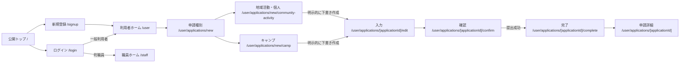
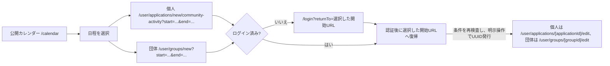
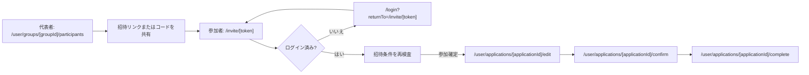
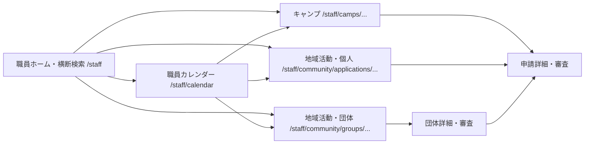

# ひらいずみ志業ポータル ルーティング設計書

> 平泉町志業シェアハウス利用申請・管理システム

| 項目 | 内容 |
|---|---|
| 文書版 | 1.0 |
| 作成日 | 2026年9月9日 |
| 対象 | スパルタキャンプ自主制作として開発する試作版 |
| フレームワーク | Next.js App Router 16.3.4 |
| 言語 | JavaScript（`page.js`） |
| 文書の位置付け | `requirements.md` に基づく、実装予定の採用ルーティング設計 |

## 1. この文書の目的

本書は、ひらいずみ志業ポータルの画面、URL、App Routerのフォルダ、認証・認可、Server / Client Componentの境界、データ取得・更新方法、主な画面遷移を定める。

本書は実装進捗表ではない。各ルートの実装状況はGitおよびタスク管理で追跡する。上位の業務要件は `requirements.md` を正とし、本書に記載のない状態遷移、権限、入力条件を省略してよいものとはしない。

## 2. 設計方針

1. プロジェクト直下の `app` を使用し、`src` ディレクトリは使用しない。
2. Route Groupは使用せず、URLと `app` 配下のフォルダを一致させる。
3. 未ログイン画面はURL直下、一般利用者は `/user`、町職員は `/staff` に分ける。
4. `/user` 自体を利用者ホーム、`/staff` 自体を職員ホーム兼全申請横断検索画面とする。`/user/dashboard` は設けない。
5. `page.js` と `layout.js` はServer Componentを基本とする。ブラウザ操作が必要な部分だけを小さなClient Componentに分ける。
6. UIからの更新はServer Actionsを基本とする。Route Handlerは、ブラウザ以外からHTTPで受ける必要がある処理だけに限定する。
7. 動的URLには推測困難なUUIDを使用する。利用者向けの受付番号 `SG-西暦-連番` は別に発行・表示し、URLのUUIDで代用しない。
8. URLが推測困難であることを認可の代わりにしない。ページ、データ取得、Server Action、Supabase Row Level Securityの各層で権限を確認する。
9. 画面表示のためのGETではデータを作成・更新しない。下書きは、利用者が最初に「下書き保存」または「確認へ進む」を実行した時点で作成する。
10. 本システムが扱うのは「予約」ではなく「使用許可申請」である。提出完了を利用確定と表現しない。

## 3. URLと識別子の規則

| 表記 | 内容 |
|---|---|
| `[applicationId]` | 個人申請または団体参加者の個別申請を識別するUUID |
| `[groupId]` | 団体全体を識別するUUID |
| `[campId]` | スパルタキャンプを識別するUUID |
| `[blockedPeriodId]` | 利用停止期間を識別するUUID |
| `[token]` | 団体招待専用の推測困難なトークン。団体UUIDとは別の値 |
| `community-activity` | 「地域活動利用・個人」のURL用スラッグ |
| `community` | 町職員画面で地域活動利用をまとめるURL用スラッグ |
| `blocked-periods` | 画面表示名「利用停止期間」のURL用スラッグ |

動的セグメント名は、実装時も `[id]` に省略せず、`[applicationId]` のように対象を明示する。Next.js 16では `params` と `searchParams` はPromiseとして扱い、Server Component内で `await` して使用する。

## 4. App Routerのフォルダ構成

```text
app/
├── layout.js
├── page.js                                      # /
├── loading.js
├── error.js
├── not-found.js
├── calendar/
│   └── page.js                                  # /calendar
├── login/
│   └── page.js                                  # /login
├── signup/
│   └── page.js                                  # /signup
├── forgot-password/                             # 任意機能
│   └── page.js                                  # /forgot-password
├── reset-password/                              # 任意機能
│   └── page.js                                  # /reset-password
├── auth/
│   └── callback/                                # 任意認証機能で使用
│       └── route.js                             # /auth/callback
├── invite/
│   ├── page.js                                  # /invite
│   └── [token]/
│       └── page.js                              # /invite/[token]
├── forbidden/
│   └── page.js                                  # /forbidden
├── user/
│   ├── layout.js
│   ├── page.js                                  # /user
│   ├── profile/
│   │   └── page.js                              # /user/profile
│   ├── applications/
│   │   ├── page.js                              # /user/applications
│   │   ├── new/
│   │   │   ├── page.js                          # /user/applications/new
│   │   │   ├── camp/
│   │   │   │   └── page.js                      # /user/applications/new/camp
│   │   │   └── community-activity/
│   │   │       └── page.js                      # /user/applications/new/community-activity
│   │   └── [applicationId]/
│   │       ├── page.js                          # /user/applications/[applicationId]
│   │       ├── edit/page.js
│   │       ├── confirm/page.js
│   │       ├── complete/page.js
│   │       ├── cancel/page.js
│   │       └── extension/page.js
│   └── groups/
│       ├── page.js                              # /user/groups
│       ├── new/page.js                          # /user/groups/new
│       └── [groupId]/
│           ├── page.js                          # /user/groups/[groupId]
│           ├── edit/page.js
│           ├── participants/page.js
│           ├── confirm/page.js
│           ├── complete/page.js
│           └── cancel/page.js
└── staff/
    ├── layout.js
    ├── page.js                                  # /staff
    ├── camps/
    │   ├── page.js                              # /staff/camps
    │   ├── new/page.js                          # /staff/camps/new
    │   └── [campId]/
    │       ├── page.js                          # /staff/camps/[campId]
    │       ├── edit/page.js
    │       ├── eligible-users/page.js
    │       └── applications/
    │           ├── page.js
    │           └── [applicationId]/page.js
    ├── community/
    │   ├── page.js                              # /staff/community
    │   ├── applications/
    │   │   ├── page.js
    │   │   └── [applicationId]/page.js
    │   └── groups/
    │       ├── page.js
    │       └── [groupId]/page.js
    ├── calendar/
    │   ├── page.js                              # /staff/calendar
    │   └── blocked-periods/
    │       ├── page.js
    │       ├── new/page.js
    │       └── [blockedPeriodId]/edit/page.js
    └── settings/
        └── page.js                              # /staff/settings
```

## 5. 公開・認証ルート

| URL | App Router | 画面・処理の目的 | 認証 | Component / 更新方法 | 主な遷移 |
|---|---|---|---|---|---|
| `/` | `app/page.js` | サービス概要、対象者、利用条件、料金、必要書類、申請開始への2つの入口を表示する | 不要 | Server。公開情報だけを取得 | `/calendar`、`/login`、`/signup`、認証後の申請開始 |
| `/calendar` | `app/calendar/page.js` | 個人・団体を特定できない公開可能な空き状況を月単位で表示する | 不要 | Serverで月データを取得。月移動と日程選択だけClient | 地域活動の申請開始。未ログインなら認証後に選択日程を復元 |
| `/login` | `app/login/page.js` | 一般利用者と町職員のログイン | 不要 | Server ActionでSupabase Authへログイン | 通常利用者は `/user`、町職員は `/staff`、招待経由は元の招待URL |
| `/signup` | `app/signup/page.js` | 一般利用者の新規登録 | 不要 | Server Actionで一般利用者だけを登録 | 安全な `returnTo`、なければ `/user` |
| `/invite` | `app/invite/page.js` | 団体招待コードを手入力する | 不要 | Serverでコードを検証。参加確定は認証後のServer Action | 有効な `/invite/[token]`、認証が必要なら `/login` |
| `/invite/[token]` | `app/invite/[token]/page.js` | 共通招待リンクの確認、認証、団体参加、個別申請開始 | 閲覧入口は不要、参加は必要 | Serverでトークン状態を検査。参加はServer Action | 未ログインは `/login?returnTo=...`、参加後は本人の `/user/applications/[applicationId]/edit` |
| `/forbidden` | `app/forbidden/page.js` | 認証済みだが役割により領域へ入れないことを表示する | 必要 | Server。ページ自身でセッションを確認し、個別データは取得しない | 利用者は `/user`、町職員は `/staff` |

### 5.1 招待ルートの表示制限

- 認証前はトークンの有効性を検査するが、団体名、参加者名、申請状態などの個人・団体情報を表示しない。
- 無効、期限切れ、満員、無効化済み、または本人が参加済みの場合も `/invite/[token]` 上で状態に応じた案内と問い合わせ導線を表示する。
- 認証後もトークンを保持し、元の招待画面へ戻す。
- 団体参加を確定するServer Actionで、期限、団体状態、予定人数、重複参加を再検査する。
- 団体代表者が招待リンクを再発行した場合は、古いトークンを無効にする。

### 5.2 任意の認証ルート

パスワード再設定は `requirements.md` の「時間があれば追加」に該当し、MVP必須ルートへは含めない。実装する場合は次を一組として追加する。

| URL | App Router | 目的 | Component / 更新方法 |
|---|---|---|---|
| `/forgot-password` | `app/forgot-password/page.js` | 再設定メールの送信を依頼する | Server Action |
| `/auth/callback` | `app/auth/callback/route.js` | Supabaseから受け取った認証コードをサーバーで交換する | Route Handler |
| `/reset-password` | `app/reset-password/page.js` | 新しいパスワードを設定する | Server Action |

コールバック後の遷移先は同一オリジンの許可済みパスだけに制限する。一般利用者が新規登録時に町職員の役割を選択する機能は設けない。

## 6. 一般利用者ルート

### 6.1 ホーム・プロフィール

| URL | App Router | 画面の目的 | Component / データ | 主な遷移 |
|---|---|---|---|---|
| `/user` | `app/user/page.js` | 自分の申請・団体の状態、期限、次に必要な操作をまとめて表示する | Serverで本人が閲覧できる概要だけを取得 | 申請一覧、新規申請、団体一覧、招待、プロフィール |
| `/user/profile` | `app/user/profile/page.js` | 氏名、住所、電話番号、緊急連絡先を閲覧・更新する | Serverで取得、Server Actionで更新 | 保存後は同画面または `/user` |

プロフィールでは認証メールアドレスと役割を変更しない。プロフィールを更新しても、提出済み申請が保持する申請時点の情報の写しは書き換えない。

### 6.2 個人申請・団体参加者の個別申請

`/user/applications` は、スパルタキャンプ利用、地域活動利用・個人、団体参加者の個別申請を共通して扱う。団体全体は `/user/groups` で扱う。

| URL | App Router | 画面の目的 | Component / 更新方法 | 主な遷移 |
|---|---|---|---|---|
| `/user/applications` | `app/user/applications/page.js` | 本人の進行中・過去の個別申請一覧 | Serverで本人分だけ取得 | 詳細、新規申請 |
| `/user/applications/new` | `app/user/applications/new/page.js` | スパルタキャンプ利用、地域活動利用・個人、団体作成の入口を選ぶ | Server。GETでは下書きを作らない | `/user/applications/new/camp`、`/user/applications/new/community-activity`、`/user/groups/new` |
| `/user/applications/new/camp` | `app/user/applications/new/camp/page.js` | 対象メールと一致する申請可能なキャンプを確認・選択する | Serverで対象資格を確認。「下書き保存」または「確認へ進む」でUUID付き下書きを作成 | `/user/applications/[applicationId]/edit` |
| `/user/applications/new/community-activity` | `app/user/applications/new/community-activity/page.js` | 地域活動利用・個人の日程と開始条件を確認する | Serverで日程条件を確認。「下書き保存」または「確認へ進む」でUUID付き下書きを作成 | `/user/applications/[applicationId]/edit` |
| `/user/applications/[applicationId]` | `app/user/applications/[applicationId]/page.js` | 申請内容、受付番号、3種類の状態、履歴、料金、納付、部屋、滞在、必要時の町連絡先を表示する | Serverで本人の申請だけ取得 | 状態に応じて編集、キャンセル、延長 |
| `/user/applications/[applicationId]/edit` | `app/user/applications/[applicationId]/edit/page.js` | 下書きまたは修正依頼中の申請を入力・修正し、同意書を添付する | Serverで初期値取得。Clientは条件分岐入力。Server Actionで下書き保存と非公開Storageへの保存 | `/confirm`、保存後は同画面または詳細 |
| `/user/applications/[applicationId]/confirm` | `app/user/applications/[applicationId]/confirm/page.js` | 提出前に全入力内容、期間、料金見込みを確認する | Serverで最新の下書きを再取得。提出はServer Action | 成功時 `/complete`、競合・入力不備時 `/edit` |
| `/user/applications/[applicationId]/complete` | `app/user/applications/[applicationId]/complete/page.js` | 提出成功後の受付番号、提出日時、状態を表示する | Serverで実際の提出済み状態を確認 | 申請詳細、利用者ホーム |
| `/user/applications/[applicationId]/cancel` | `app/user/applications/[applicationId]/cancel/page.js` | 対象となる地域活動利用のキャンセル理由と影響を確認する | Serverで状態を確認し、「許可」の場合だけ滞在状態が「入居前」かも確認する。Server Actionでキャンセル申請 | 申請詳細 |
| `/user/applications/[applicationId]/extension` | `app/user/applications/[applicationId]/extension/page.js` | 元申請を変更せず、追加期間の別申請を開始する | Serverで元申請とプロフィールを取得。明示操作で元申請に紐づく新規下書きを作成 | 新しい申請の `/edit` |

初回表示だけでは下書きを作成しない。通常申請は `/user/applications/new/...` の「下書き保存」または「確認へ進む」、団体は `/user/groups/new` の初回保存、招待参加者は `/invite/[token]` の参加確定という明示操作でUUIDを発行する。UUID発行後の `/edit` は既存の下書きを更新する。この時点では受付番号を発行せず、日程・定員も確保しない。受付番号は提出成功時に発行する。

`/edit`、`/confirm`、`/cancel`、`/extension` を直接開いた場合も、所有者、申請種別、状態、期限、滞在状態をサーバーで検査する。本人の申請だが現在の状態では操作できない場合は詳細へ戻して理由を表示し、本人以外の申請は404として扱う。

### 6.3 団体

| URL | App Router | 画面の目的 | Component / 更新方法 | 主な遷移 |
|---|---|---|---|---|
| `/user/groups` | `app/user/groups/page.js` | 代表・参加している進行中および過去の団体一覧 | Serverで本人が関係する団体だけ取得 | 団体詳細、新規団体 |
| `/user/groups/new` | `app/user/groups/new/page.js` | 団体共通情報、日程、予定人数の初回入力 | Serverで条件・空き状況を確認。最初の「下書き保存」または「確認へ進む」でUUID付き団体下書きを作成 | `/user/groups/[groupId]/edit` |
| `/user/groups/[groupId]` | `app/user/groups/[groupId]/page.js` | 団体共通情報、団体状態、期限、参加者の氏名と提出・審査状態、見込料金・納付済み人数を表示する | Serverで代表者・参加者の表示範囲を分けて取得 | 編集、参加者管理、キャンセル |
| `/user/groups/[groupId]/edit` | `app/user/groups/[groupId]/edit/page.js` | 許可された状態・期限内で団体共通情報を編集する | Serverで取得、Server Actionで下書き保存 | `/confirm`、団体詳細 |
| `/user/groups/[groupId]/participants` | `app/user/groups/[groupId]/participants/page.js` | 代表者が参加者の氏名・提出状態を管理し、共通招待リンクとコードを確認・再発行する | Serverで代表者権限を確認。追加・削除・再発行はServer Actions | 団体詳細、参加者の個別申請状態 |
| `/user/groups/[groupId]/confirm` | `app/user/groups/[groupId]/confirm/page.js` | 団体情報、予定人数、利用期間、提出期限への影響を提出前に確認する | Serverで最新下書きを取得。提出はトランザクションを呼ぶServer Action | 成功時 `/complete`、不備・競合時 `/edit` |
| `/user/groups/[groupId]/complete` | `app/user/groups/[groupId]/complete/page.js` | 団体受付番号、提出日時、団体状態、日程確保を表示する | Serverで実際の提出状態を確認 | 団体詳細、参加者管理 |
| `/user/groups/[groupId]/cancel` | `app/user/groups/[groupId]/cancel/page.js` | 代表者が団体全体のキャンセル理由と全参加者・日程への影響を確認する | Serverで代表者、団体状態、滞在開始前を確認。Server Actionでキャンセル申請 | 団体詳細 |

団体代表者が閲覧できる参加者情報は、氏名、参加状態、提出・審査状態に限定する。参加者の住所、電話番号、個人の緊急連絡先、保護者同意書は、団体詳細・参加者管理の取得結果へ含めない。団体参加者には、他の参加者の氏名を含む個人情報を表示しない。

団体の初回表示だけでは下書きや日程枠を作成しない。代表者の明示操作で下書きを作成し、団体を「申請中」にする提出処理でのみ、最新の競合を再検査して日程を確保する。

## 7. 町職員ルート

すべての `/staff` ルートは町職員だけが利用できる。職員権限はSupabase側でのみ付与し、`app/staff/layout.js` の共通確認に加えて、各データ取得とServer Actionでも役割を再確認する。

### 7.1 職員ホーム・全申請横断検索

| URL | App Router | 画面の目的 | Component / 更新方法 | 主な遷移 |
|---|---|---|---|---|
| `/staff` | `app/staff/page.js` | 全申請を氏名、団体名、利用期間で横断検索し、利用区分・申請・納付・滞在状態で絞り込む。各領域の要対応件数も表示する | Serverで検索条件に一致する必要最小限の概要を取得。検索フォームはGET | キャンプ申請、地域活動の個人申請、団体の各詳細 |

キャンプと地域活動の詳細ルートは分離するが、`requirements.md` が求める全申請の横断検索は `/staff` に残す。検索結果は対象の種別に応じた詳細URLへリンクする。

### 7.2 スパルタキャンプ

| URL | App Router | 画面の目的 | Component / 更新方法 | 主な遷移 |
|---|---|---|---|---|
| `/staff/camps` | `app/staff/camps/page.js` | キャンプ一覧と申請期限・期間の概要を表示する | Serverで一覧取得 | 新規登録、キャンプ詳細 |
| `/staff/camps/new` | `app/staff/camps/new/page.js` | キャンプ名、固定期間、申請期限を登録する | Server Action。日程競合を検査 | 作成したキャンプ詳細 |
| `/staff/camps/[campId]` | `app/staff/camps/[campId]/page.js` | キャンプ設定、対象者数、申請状況、日程への影響を表示する | Serverでキャンプ単位に取得 | 編集、対象者、申請一覧 |
| `/staff/camps/[campId]/edit` | `app/staff/camps/[campId]/edit/page.js` | キャンプ名、固定期間、申請期限を編集し、条件を満たす場合はキャンプ期間を削除する | Server Action。競合申請と影響を表示し、未解決の競合がある編集・削除は実行しない | キャンプ詳細 |
| `/staff/camps/[campId]/eligible-users` | `app/staff/camps/[campId]/eligible-users/page.js` | 対象メールを登録・編集し、形式不正・重複を表示する | Serverで一覧取得、Server Actionで一括登録・更新 | キャンプ詳細、申請一覧 |
| `/staff/camps/[campId]/applications` | `app/staff/camps/[campId]/applications/page.js` | 対象キャンプの個人申請を検索・絞り込みする | Serverでキャンプに属する申請だけ取得 | 申請詳細 |
| `/staff/camps/[campId]/applications/[applicationId]` | `app/staff/camps/[campId]/applications/[applicationId]/page.js` | キャンプ個人申請の審査、部屋割り、料金・納付、入退去、メモ、履歴を扱う | Serverで取得。各更新は権限・状態・更新日時を検査するServer Actions | キャンプ詳細、申請一覧 |

`campId` と `applicationId` の関連を必ず検証し、別キャンプの申請を誤って表示・更新しない。スパルタキャンプ利用者には本人によるキャンセル申請画面を表示せず、本人から町への連絡後に職員が申請詳細から処理する。

### 7.3 地域活動利用

| URL | App Router | 画面の目的 | Component / 更新方法 | 主な遷移 |
|---|---|---|---|---|
| `/staff/community` | `app/staff/community/page.js` | 地域活動利用・個人と団体の件数、期限、要対応項目を表示する | Serverで集計 | 個人申請一覧、団体一覧 |
| `/staff/community/applications` | `app/staff/community/applications/page.js` | 地域活動利用・個人と団体参加者の個別申請を検索・絞り込みする | Serverで対象種別だけ取得 | 個別申請詳細 |
| `/staff/community/applications/[applicationId]` | `app/staff/community/applications/[applicationId]/page.js` | 個別申請の審査、料金・納付、入退去、メモ、履歴を扱う。地域活動利用・個人の場合だけ個人単位の部屋割りを扱う | Serverで取得。更新はServer Actions | 一覧、関連団体 |
| `/staff/community/groups` | `app/staff/community/groups/page.js` | 地域活動利用・団体を検索・絞り込みする | Serverで団体一覧を取得 | 団体詳細 |
| `/staff/community/groups/[groupId]` | `app/staff/community/groups/[groupId]/page.js` | 団体目的の審査、参加者個別申請、期限、部屋別人数、見込料金、納付状況、入退去、メモ、履歴を関連付けて扱う | Serverで職員向け情報を取得。更新はServer Actions | 団体一覧、各参加者の個別申請詳細 |

申請詳細と団体詳細は、審査、料金・納付、滞在、内部メモ、履歴を同じページ内のセクションとして表示する。地域活動利用・個人の申請詳細では個人単位の部屋割りを扱う。団体参加者の個別申請では部屋割りを閲覧・更新せず、関連する団体詳細で部屋別人数を管理する。MVPではこれらを別URLに分割しない。画面を閲覧しただけでは「審査中」に変更せず、明示的な審査開始操作でのみ状態を更新する。`/staff/community/applications/[applicationId]` でキャンプ申請を指定した場合は、そのキャンプ配下の正規URLへ送る。

2026年9月12日、職員ホームの検索をキャンプと地域活動個人の切替に対応させ、地域活動個人の詳細画面を実装した。詳細画面では既存の取得・更新処理だけを利用し、審査開始、修正依頼、不許可、取消確定、部屋割当、許可、納付、入退去、職員メモ、履歴、保護者同意書を同じ画面へ接続する。一般利用者で職員URLを開くと`/forbidden?reason=staff-only`へ遷移することをChromeで確認済み。実職員アカウントでは、架空申請の詳細表示、審査開始、部屋割当、許可、納付期限、職員メモを画面から保存し、状態・滞在・履歴への反映を確認した。修正依頼、不許可、取消確定、入退去、同意書取得は別シナリオでの受入確認が必要。

### 7.4 カレンダー・利用停止期間・設定

| URL | App Router | 画面の目的 | Component / 更新方法 | 主な遷移 |
|---|---|---|---|---|
| `/staff/calendar` | `app/staff/calendar/page.js` | キャンプ、地域活動の個人・団体、利用停止期間を区別して表示する | Serverで指定月を取得。カレンダー操作だけClient | 各申請・団体・キャンプ、利用停止期間一覧 |
| `/staff/calendar/blocked-periods` | `app/staff/calendar/blocked-periods/page.js` | 利用停止期間と内部理由を一覧表示する | Serverで取得 | 新規登録、編集、職員カレンダー |
| `/staff/calendar/blocked-periods/new` | `app/staff/calendar/blocked-periods/new/page.js` | 利用停止期間と内部理由を登録する | Server Action。既存申請との競合を検査 | 一覧、競合時は入力画面 |
| `/staff/calendar/blocked-periods/[blockedPeriodId]/edit` | `app/staff/calendar/blocked-periods/[blockedPeriodId]/edit/page.js` | 利用停止期間を編集・削除する | Server Action。影響申請を表示し、競合時は保存しない | 一覧、職員カレンダー |
| `/staff/settings` | `app/staff/settings/page.js` | 町の緊急連絡先名、電話番号、対応時間を管理する | Serverで取得、Server Actionで更新 | 職員ホーム |

料金単価、月上限、部屋名、部屋定員、施設定員、申請状態、受付条件、職員権限は固定の業務ルールまたはSupabase側の管理対象であり、`/staff/settings` から変更しない。

## 8. 認証・認可とルートガード

| 状況 | 挙動 |
|---|---|
| 未ログインで `/user` または `/staff` を開く | `/login` へ送り、安全な `returnTo` に元の内部パスを保持する |
| 未ログインで `/forbidden` を直接開く | ページ自身のセッション確認により `/login` へ送る |
| 通常ログイン | 一般利用者は `/user`、町職員は `/staff` へ送る |
| 招待リンク経由のログイン | 認証後に元の `/invite/[token]` へ戻す |
| ログイン済み利用者が `/staff` を開く | `/forbidden` を表示する |
| ログイン済み町職員が一般利用者用の開始画面を開く | `/staff` へ送る |
| 他人の申請・無関係な団体・存在しないUUID | `notFound()` を使用し、存在の有無を推測させない |
| 本人のデータだが状態・期限上その操作ができない | 詳細へ戻し、操作できない理由と次に可能な操作を表示する |
| ログアウト | Server Actionでセッションを破棄し、公開トップ `/` へ送る |

`returnTo` は相対パスかつ許可済みの内部ルートだけを受け付ける。完全URL、プロトコル相対URL、`javascript:`、外部ドメインは拒否し、オープンリダイレクトを防ぐ。

### 8.1 多層防御

1. `app/user/layout.js` と `app/staff/layout.js` でセッションと役割を確認する。
2. 各Server Componentで、対象レコードを現在の利用者または町職員の権限範囲に絞って取得する。
3. 各Server Actionで、セッション、役割、所有者、状態、期限、`updated_at` を更新直前に再検査する。
4. Supabase RLSで、一般利用者、団体代表者、団体参加者、町職員の閲覧・更新範囲を制限する。
5. 管理用秘密鍵が必要なアカウント停止・初期化処理はサーバー側だけで実行し、ブラウザへ秘密鍵を渡さない。

## 9. Server / Client Componentとデータ処理

### 9.1 Server Componentを基本とする画面

- 公開トップ、利用案内、一覧、詳細、確認、完了、設定画面
- 認証・役割・所有者を確認するすべてのページ
- 個人情報、職員情報、内部理由、内部メモを取得する画面
- URLクエリを使った検索・絞り込み結果

### 9.2 Client Componentに分ける部分

- カレンダーの月移動、日付範囲選択
- 申請種別や入力値に応じて表示が変わるフォーム部分
- ファイル選択、アップロード前の形式・容量表示
- 送信中のボタン無効化と進行表示
- 職員画面の部屋割りなど、操作性のために局所的な状態が必要な部分
- `app/error.js`。エラー境界の仕様上Client Componentとする

Client Componentへ渡すpropsは表示に必要な最小限とし、団体代表者や他参加者へ見せてはならない個人情報をServer Componentから渡さない。

### 9.3 データ取得・更新

| 処理 | 方針 |
|---|---|
| 表示データ取得 | Server Componentからサーバー用Supabaseクライアントで取得し、RLSを適用する |
| フォーム更新 | Server Actionで入力検証、認証・認可、状態検査、更新を行う |
| 日程・定員の枠確保 | Server ActionからDBトランザクションまたはRPCを呼び、空き確認と確保を不可分にする |
| 二重送信防止 | Client側で送信中を無効化し、Server / DB側でも一意制約や冪等性を持たせる |
| 更新競合 | `updated_at` を比較し、古い画面からの上書きを拒否して再読込みを案内する |
| 表示更新 | 成功後に必要な `revalidatePath` を実行し、GET可能な画面へ `redirect` する |
| 同意書アップロード | `/user/applications/[applicationId]/edit` のServer Actionで形式・5MB上限・所有者を検証し、非公開Storageへ保存する |
| 同意書参照 | 専用ファイル管理ルートを設けず、申請詳細のServer Actionで本人または町職員を検証して短時間の参照手段を発行する |

同意書のDB項目には公開URLではなくStorage上のパスを保持する。団体代表者や他参加者へパスや参照手段を返さない。

### 9.4 T09バックエンドの接続契約（SQL 012）

以下の処理はコード作成・ローカル検証済み。SQL 012はSupabase適用成功をユーザーが確認した。適用後はanon権限による公開カレンダー取得の表示形式・エラーなしをユーザーが確認済み。単一接続328項目（T09の110＋既存218）と別接続20ケース、検証用データの後片付けも、SQL 012適用後のSupabaseで成功をユーザーが確認した。画面接続は未実施で、対応する画面・保護layoutは未作成。SQL 012のカレンダーはキャンプと利用停止を扱う。SQL 013による個人の追加は9.5節、団体は後続タスク。

`utils/calendar/queries.js` はサーバー専用。ページの月クエリは本書10章の規則で正規化した後に渡す。取得関数自身は不正値をエラーにし、当月へ自動補正しない。

| 取得関数 | 入力 | 返却 |
|---|---|---|
| `getPublicCalendar` | `YYYY-MM` | `{ error, days }`。各日は `date / availability` の2項目だけ |
| `getStaffCalendar` | `YYYY-MM` | `{ error, entries }`。各行は `entry_type / entry_id / start_date / end_date / title / people_count / internal_reason / updated_at` |
| `getStaffCalendarDay` | `YYYY-MM-DD` | `{ error, entries }`。各行は `entry_type / entry_id / camp_id / reception_number / display_name / people_count / status / start_date / end_date / internal_reason / updated_at` |
| `getStaffBlockedPeriods` | `YYYY-MM` | `{ error, periods }`。職員月取得のうち利用停止だけ。同じ行形式 |
| `getStaffBlockedPeriod` | 利用停止UUID | `{ error, period }`。単一の `id / start_date / end_date / internal_reason / updated_at`。削除済みは取得対象外 |

成功時の `error` はNULL。失敗時は `invalid-month / invalid-period / not-found / load-failed` と空配列またはNULLを返す。職員用の全関数は入力検査前に `requireStaff` を呼ぶ。未ログイン・権限不足の遷移は既存ガードに従う。

公開値の表示は `available → 申請可能`、`unavailable → 利用不可`、`not_yet_open → 受付開始前`。職員の日別取得にはキャンプの合計行と個別申請行が含まれるため、両方の人数を加算しない。内部理由・職員応答を公開側のpropsや共有キャッシュへ流用しない。

| Action | フォームの入力名 | 成功時の遷移 |
|---|---|---|
| `createStaffCamp` | `campName / startDate / endDate / applicationDeadline` | `/staff/camps/[campId]` |
| `updateStaffCamp` | 上記＋ `campId / updatedAt / reason` | `/staff/camps/[campId]?updated=saved` |
| `deleteStaffCamp` | `campId / updatedAt / reason` | `/staff/camps?updated=deleted` |
| `createStaffBlockedPeriod` | `startDate / endDate / internalReason` | `/staff/calendar/blocked-periods?updated=saved` |
| `updateStaffBlockedPeriod` | 上記＋ `blockedPeriodId / updatedAt / reason` | 同上 |
| `deleteStaffBlockedPeriod` | `blockedPeriodId / updatedAt / reason` | `/staff/calendar/blocked-periods?updated=deleted` |

キャンプのActionは `app/actions/staff-camps.js`、利用停止は `app/actions/staff-calendar.js`。期間は日付文字列、期限は日本時間の `YYYY-MM-DDTHH:mm`。期限の指定分を含め、次の分の00秒をDB境界へ変換する。編集用表示ではDB境界の1分前を日本時間に直す。既存DBの期限値はSQL 012で書き換えない。

`updatedAt` は取得した元レコードの `updated_at` の文字列をそのままhidden入力等で渡す。JavaScriptのDateを経由させず、マイクロ秒を保持する。変更理由は編集・削除で必須（最新日時かつ完全に同じ内容の編集だけ省略可）。キャンプ名は1〜120文字、内部理由・変更理由は1〜2000文字。

**これら6つのActionは、入力・DBエラー時に遷移せず `{ error, fields, conflicts }` を返す。** `fields` に入力を保持して同じ画面へ表示する。既存 `createStaffCamp` のエラー時クエリ遷移からの変更点であり、フォーム接続時に対応する。フォームActionの入力は `FormData` 1引数。`useActionState` を使う場合は `(previousState, formData)` を受けるアダプターで1引数のActionへ渡す。成功時は表示更新後に遷移する。

| 主なエラー | 表示する内容・対応 |
|---|---|
| `invalid-period / invalid-name / invalid-deadline / invalid-version` | 日付・名称・期限・更新情報の不備を修正。期限は開始日の00:00を越えない |
| `reason-required / reason-too-long` | 理由を入力、または2000文字以内に修正 |
| `date-conflict / camp-has-applications` | `conflicts` の必要概要を職員だけに表示。影響する申請・日程を確認後、再操作 |
| `stale-update` | 別の更新が先に完了したため保存されなかったと案内。入力を保持し、再読込み後に利用者が判断。自動上書きしない |
| `not-found / invalid-status / forbidden / update-failed` | 対象不存在・削除済み・権限不足・保存失敗を案内。DB内部エラーは表示しない |

`conflicts` は `type / id / campId / name / receptionNumber / status / startDate / endDate` の配列。日程競合・既存申請による変更拒否以外は空配列。住所・電話・メール・生のDBエラーは含めない。

`addCampEligibleUsers` の入力・クエリ返却は従来どおり。キャンプ申請Actionにも `stale-update / calendar-unavailable` を追加し、提出後の職員カレンダー等を再取得対象にする。既存の個人審査・部屋割当Actionの契約は維持する。

### 9.5 T10バックエンドの接続契約（SQL 013）

地域活動の個人だけを扱う。バックエンドのコード・ローカル検証、SQL 013のSupabase適用、単一接続558項目・別接続40ケースと全後片付けが完了。Supabaseの適用・各集約結果・後片付けの成功は2026年9月11日のユーザー確認に基づく。新規・入力・確認・完了・詳細画面へ以下の契約を接続済みで、実ログイン・実Storageの受入確認は未実施。キャンセル・延長、職員側の許可・部屋割り・納付変更・入退去、団体の画面は別途接続する。

本人Actionは `app/actions/community-applications.js`。どのActionも最初にactiveなログイン本人を確認し、DBでも所有者・区分・状態・日程を検査する。入力は `FormData` 1引数。`useActionState` では `(previousState, formData)` のアダプターを介する。

| Action | 入力 | 成功時 |
|---|---|---|
| `createCommunityApplicationDraft` | `applicationId`（保存操作用UUID）、任意の下記項目、`intent` | UUID付き下書きを作成。`intent=confirm` なら共通申請の `/confirm`、それ以外は `/edit?saved=1` |
| `saveCommunityApplicationDraft` | UUID、`updatedAt`、編集可能な全項目、`intent` | 下書きまたは修正依頼の内容を保存。同上 |
| `submitCommunityApplication` | UUID、`updatedAt`、`submissionKey`（UUID）、`confirmed=true` | 初回／再提出をDBで確定し `/user/applications/[applicationId]/complete` |

新規開始ページのGETはURLの `start / end` を初期値として取り込み、保存・確認への明示操作まで作成しない。新規登録・ログインの `returnTo` に日程付きの安全な本人URLを渡す。作成操作のUUIDは通信再送時に同じ値を使い、再送による重複下書きを防ぐ。初期作成で省略した項目はプロフィール初期値を使い、空文字を明示した項目は空にする。既存保存は部分更新ではなく全編集項目の置換。

| フォーム名 | DB名・条件 |
|---|---|
| `applicantName / applicantAddress / applicantPhone` | `user_name / user_address / user_phone`。100／500／20文字以内 |
| `emergencyContactName / emergencyContactAddress / emergencyContactPhone` | `emergency_name / emergency_address / emergency_phone`。同上 |
| `usagePurpose / localActivity / notes` | `purpose / local_activity / special_notes`。各2000文字以内、notesだけ提出時も任意 |
| `usagePlace` | `common_and_second_floor` 固定 |
| `guardianConsentRequired` | `true / false` を明示（`on / off / 1 / 0` も受付）。未回答は提出不可。trueなら同意書必須 |
| `startDate / endDate` | `YYYY-MM-DD`。下書きは両方空可。設定する場合は実在する2〜15日 |

メールは入力から保存せず、提出時の認証情報をDBで写す。申請者・使用者は本人1人。人数・所有者・金額・状態・納付情報・キャンプID・部屋希望は個人フォームの保存対象にしない。電話番号は既存プロフィールと同じ形式を使用する。

更新日時は `updated_at` の元の文字列をマイクロ秒まで保持する。同意書差替・職員操作でも更新される。確認画面を取得したら、新しい提出のための `submissionKey` を用意する。同じ提出通信を再送するときだけキーと元の `updatedAt` を再利用する。別の修正再提出は新しいキーと、保存後に取得した版を使う。戻る・再読込みを含め、`stale-update` を無視して最新の版へ差し替え自動送信しない。

エラーは遷移せず **`{ error, fields, fieldErrors }`**。fieldsには入力を保持し、fieldErrorsはフォーム名→エラーコード。ClientへDBのmessage/detail、他人の競合概要、内部監査、Storageパスを返さない。成功は必要ルートを再検証した後に遷移する。

| 主なエラー | 表示・対応 |
|---|---|
| `required-fields / invalid-fields / field-too-long / invalid-phone / invalid-place` | 必須・形式・文字数を直す。保持した入力を再表示 |
| `invalid-period / invalid-duration` | 実在する日付、1泊2日〜14泊15日に直す |
| `start-too-soon / end-too-late` | 初回／変更日程をJST当日+14〜60日の条件内に直す |
| `calendar-unavailable / capacity-full / duplicate-stay` | 利用停止等・満員・本人の重複を案内。競合相手の個人情報は出さない |
| `guardian-consent / confirmation-required` | 必要な同意書、最終確認同意を案内 |
| `invalid-version / stale-update` | 別の更新により保存・提出されなかったと案内し、入力を保持して再取得後に本人が判断 |
| `revision-expired / not-editable / not-submittable` | 現在の状態・期限を表示。勝手に取消せず、必要なら問い合わせへ案内 |
| `not-found / forbidden / calendar-inconsistent / update-failed` | 閲覧不能・権限不足・保存不能として扱い、DB内部情報は表示しない |

`utils/community-applications/queries.js` の取得はすべて本人のactive認証から開始し、キャッシュ共有や業務更新をしない。

| 取得関数 | 返却・接続先 |
|---|---|
| `getCommunityApplications(page=1)` | `{ error, applications }`。本人のcommunity_individualだけ、1ページ50件、作成日時・ID降順。固定のID・状態・日程・更新／提出日時・理由・期限。キャンプ等との統合一覧はT08/T16で別途接続 |
| `getCommunityApplication(id, mode='detail')` | `{ error, application }`。modeはdetail／edit／confirm／complete。必須値・受付窓・定員等の確認結果をconfirmで返す。完了はDBに提出日時・受付番号がある場合だけ |

applicationは `id / status / updated_at / fields / reserved_start_date / reserved_end_date / submitted_at / last_submitted_at / revision_due_at / decision_reason / reception_number / has_consent / can_edit / events / estimated_months / charge`。fieldsは上表のDB列名。修正中はfieldsの日程が候補、reservedの日程が元の提出期間。不許可等の状態では枠が有効とは限らないため、予約確定と表示しない。eventsは本人開示可能な状態・理由・日時だけ。chargeは合計・納付状態・納付期限・月別内訳、estimated_monthsは保存中の日程の見込内訳。金額・番号をURLクエリから表示しない。メール表示はServerで取得する本人の認証情報を使う。

職員Actionは `app/actions/staff-community-applications.js`。全操作で `requireStaff` とDBのactive職員検査が必要。共通入力は `applicationId / updatedAt`。成功後は `/staff/community/applications/[applicationId]?updated=状態` に遷移し、エラー形式は本人Actionと同じ。

| Action | 状態・追加入力 |
|---|---|
| `startCommunityApplicationReview` | submitted→under_review。理由・期限は保存しない |
| `requestCommunityApplicationRevision` | under_review→revision_requested。`reason`必須、`revisionDeadline`任意 |
| `rejectCommunityApplication` | under_review→rejected。`reason`必須。個人枠を全解放し、番号・料金・履歴を維持 |

理由は2000文字以内。修正期限はJST `YYYY-MM-DDTHH:mm` の指定分を含める（23:59なら翌日00:00を排他的境界として保存）。空欄なら期限なしで、団体の3日後を自動補完しない。期限は未来かつ利用開始日の00:00以下。提出済み／審査中の直接編集は不可。修正候補の保存だけでは元の枠・料金を動かさず、再提出が成功したときだけ入れ替える。

既存 `uploadGuardianConsent` に地域活動では `applicationId / updatedAt / guardianConsentFile` を渡す。保存内容の変更と添付を同時に送らず、保存成功後の版で添付し、添付成功後に再取得した版で確認・提出する。PDF/JPEG/PNG、5MiB以下、ファイル署名検査は既存方式。提出済み旧ファイルは残し、DBが許可した下書きの旧ファイルだけ削除する。この既存Actionの失敗は `?error=...` 遷移方式で、File入力は再選択が必要（T06のUIで扱う）。

カレンダーの関数名・返却列は9.4節を維持する。個人が15人の日は公開でunavailable。職員月は `entry_type=individual`、職員日は `entry_type=application, camp_id=NULL`。個人の日程競合は職員エラーの `type=application` として最小概要を返す。職員画面はこのNULLを使い地域活動の詳細URLへつなぐ。

### 9.6 T12地域活動個人の部屋割当・許可（SQL 014）

SQL 014と更新後のActionをそろえて接続する。2026年9月11日現在はローカル検証済み。SQL 014のSupabase適用と既存回帰を含む単一接続916項目・別接続60ケース・全後片付けの成功はユーザー確認済み。画面未作成。接続先は既存の `/staff/community/applications/[applicationId]` と本人詳細で、新しい画面URLを作らない。通常の地域活動個人だけを扱い、キャンプ・延長元付き申請・団体は新RPCで拒否する。

| Action | フォーム入力 | 成功時 |
|---|---|---|
| `assignCommunityApplicationRoom` | `applicationId / updatedAt / roomId / reason` | 詳細へ `?updated=room-assigned`。初回は審査中、変更は審査中または許可後の入居前・滞在中 |
| `approveCommunityApplication` | `applicationId / updatedAt / approvalComment` | 詳細へ `?updated=approved`。審査中・有効な部屋割当・必要条件をDBで再確認し入居前滞在を作成 |

両方とも `app/actions/staff-community-applications.js` から公開する。既存3操作の契約は9.5節を維持する。人数・日程・所有者・金額・状態はフォームから更新しない。初回割当のreasonと許可コメントは任意、既存部屋の変更・解放後の再割当のreasonは必須。最大2,000文字。許可コメントと内部の部屋変更理由は別フィールド。割当・許可では `revisionDeadline` を使わない。

更新日時は申請の `updated_at` の文字列をマイクロ秒まで保持し、送信直前に最新版へ差し替えない。割当後は新しい詳細を取得し、その版で許可する。最新版の同じ割当は履歴を追加しない。古い版・40001・40P01は自動再送しない。

エラー形式は `{ error, fields, fieldErrors }` を維持する。reason／approvalComment／roomIdを含む入力を保持し、DBのdetail・hintを返さない。認証ガードの失敗は既存のログイン／権限エラー遷移。DBや入力の失敗では成功遷移や表示更新を行わない。

| エラー | 日本語表示と対応 |
|---|---|
| `room-required` | 許可前に部屋を割り当ててください |
| `invalid-room / room-capacity-full` | 部屋を選び直すか、期間中の割当状況を確認してください |
| `capacity-full / facility-capacity-full` | 施設定員15人を超えるため保存できません |
| `calendar-unavailable / duplicate-stay` | 日程の競合を確認してください |
| `invalid-version / stale-update` | 入力を保持し、最新情報を読み直して職員が再判断してください |
| `reason-required / reason-too-long` | 変更理由を入力、または2,000文字以内へ修正。許可コメントの長さエラーはapprovalCommentへ表示 |
| `invalid-status / stay-completed` | 現在の申請・滞在状態では操作できません |
| `invalid-allocation / invalid-stay / calendar-inconsistent / application-inconsistent` | 保存済み情報が整合していません。管理担当へ確認してください。画面から自動修復しない |
| `guardian-consent / required-fields / invalid-email` | 提出済み情報・必要な同意書を確認してください |
| `forbidden / not-found / update-failed` | 権限・対象申請を確認。内部SQL情報を表示しない |

`utils/community-applications/queries.js` の `getStaffCommunityApplicationRoomContext(applicationId)` はactive職員だけの読取。返却は `{ error, application }`。applicationは `id / status / updated_at / start_date / end_date / approval_comment / room_allocation / stay / rooms`。roomsは8部屋の `id / name / capacity` で、保存時の空きを保証しない。取得は1回の読取専用RPCで行い、表示中の部屋と親の版を同じスナップショットから取得する。職員の審査情報全体・一覧検索はこの取得の対象外。

本人の既存 `getCommunityApplication` には `approval_comment / room_allocation / stay` を追加する。本人／職員ともroom_allocationは `room_id / room_name / people_count / start_date / end_date / released_from / is_current`、stayは `status / checked_in_at / checked_out_at`。存在しなければnull。**`is_current=false` の旧割当を現在の部屋として表示しない。** 日程変更再提出後は旧割当が残るため、再審査で理由付きの再割当を促す。同日程の修正なら割当は維持される。

本人には内部の部屋変更理由・職員ID・監査スナップショットを渡さない。職員監査の取得は既存RLSの `audit_logs` を `entity_type='application' / entity_id=applicationId` で絞る。更新成功後は職員詳細・一覧・ホーム、カレンダー、本人詳細・一覧・編集・確認・完了を再検証してから遷移する。画面接続後の実ログイン・実Storage・ブラウザ受入は別途実施する。

## 10. URLクエリ

| 対象 | クエリ例 | 用途・検証 |
|---|---|---|
| 公開カレンダー | `/calendar?month=2026-09` | 日本時間の表示月。未指定・不正値は日本時間の当月へ正規化する |
| 職員カレンダー | `/staff/calendar?month=2026-09` | 公開情報に加えて業務詳細を取得する |
| 公開カレンダーから個人申請 | `/user/applications/new/community-activity?start=2026-09-10&end=2026-09-12` | 認証後に初期値として復元する。空き・受付条件はサーバーで再検査する |
| 公開カレンダーから団体作成 | `/user/groups/new?start=2026-09-10&end=2026-09-12` | 認証後に初期値として復元する。空き・人数・受付条件はサーバーで再検査する |
| 職員横断検索 | `/staff?q=...&usageType=...&applicationStatus=...&paymentStatus=...&stayStatus=...&from=...&to=...` | 全申請の氏名、団体名、利用期間と各状態を検索・絞り込みする |
| 領域別一覧 | 各一覧に `q`、状態、`from`、`to` | 対象領域内の検索・絞り込み。許可したキーと値だけを使用する |
| 認証後の復帰 | `/login?returnTo=%2Finvite%2F...` | 同一オリジンの許可済み内部パスだけに制限する |

検索・絞り込みはGETフォームで行い、共有、再読込み、戻る・進むで条件が維持されるようにする。クエリ値をSQL文字列へ直接連結しない。

## 11. 状態に応じた表示・遷移

### 11.1 個別申請

- 編集できるのは「下書き」または「修正依頼」の本人だけとする。
- 確認画面を直接開いた場合も、最新の下書き、所有者、入力完了状態を検査する。
- 提出時に入力、日程、定員、重複、利用資格を再検査する。地域活動利用の枠確保は提出と同じトランザクションで行う。
- 完了画面は実際に提出が成功した申請だけを表示し、受付番号、提出日時、状態をサーバーから取得する。
- 地域活動利用のキャンセル申請は、申請状態が「申請済み」「審査中」「修正依頼」の場合、または「許可」かつ滞在状態が「入居前」の場合に表示する。「滞在中」は町への連絡と早期退去を案内する。
- スパルタキャンプ利用者にはキャンセル申請操作を表示しない。
- 期間延長は元申請を変更せず、元申請に紐づく追加期間の別申請として作成する。

### 11.2 団体

- 団体の「申請中」への提出時に、期間、人数、既存申請との競合を再検査し、日程を確保する。
- 参加者の追加・削除、交代、キャンセルは団体状態と提出・修正期限に従って表示する。
- 全参加者の個別申請が提出されたときだけ、団体全体を自動で「審査中」へ進める。
- 団体全体を「不許可」にする場合は、未終了の参加者個別申請も同じトランザクションまたはRPCで「不許可」にし、共通理由を記録する。
- 参加者の個別申請を「不許可」にする場合は、団体全体も同じ処理で「修正依頼」にする。
- 団体全体のキャンセル確定では、未終了の参加者申請と日程枠を同じトランザクションまたはRPCで更新する。
- 滞在開始後は団体キャンセル申請を表示せず、町への電話連絡と早期退去を案内する。

### 11.3 町職員

- 詳細を閲覧しただけでは審査状態を変更しない。「審査開始」の明示操作でのみ「審査中」へ進める。
- 修正依頼と不許可では理由を必須とし、許可コメントは任意とする。
- スパルタキャンプ利用と地域活動利用・個人の許可前に、本人の部屋割りを完了させる。団体参加者の個別申請には個人単位の部屋割りを行わない。
- 団体全体の許可前に、全参加者の個別許可、人数一致、部屋別定員、施設定員を確認する。
- キャンプ期間または利用停止期間の変更時は、競合する申請と影響を表示し、未解決の競合があれば保存しない。
- 複数職員の更新競合時は保存を拒否し、最新情報の再読込みを案内する。
- 不許可またはキャンセル済みで退去処理がない利用者のアカウント停止は、本人から町への連絡を確認したうえで、関連する申請詳細から確認付きServer Actionとして実行し、操作履歴へ記録する。独立した利用者管理ルートは設けない。

## 12. 主な画面遷移

### 12.1 通常ログインと申請



### 12.2 公開カレンダーと地域活動利用



### 12.3 団体招待



### 12.4 町職員



## 13. 特殊ファイル

| ファイル | 役割 |
|---|---|
| `app/layout.js` | 全画面共通のHTML、メタデータ、言語設定を持つ。`lang="ja"` とサービス名を設定する |
| `app/loading.js` | 全体用の読み込み表示。状態を文字でも伝える |
| `app/error.js` | 全体用のエラー境界。Client Componentとし、再試行と安全な戻り先を示す |
| `app/not-found.js` | 存在しないURL、存在しないデータ、閲覧権限のない個別データを扱う |
| `app/user/layout.js` | 一般利用者セッションの確認と利用者ナビゲーション |
| `app/staff/layout.js` | 町職員の役割確認と職員ナビゲーション |

MVPでは `app/user` と `app/staff` 配下に個別の `loading.js`、`error.js` を置かない。全体用で不足が生じた時点で追加を検討する。

## 14. 画面ルートにしない処理とMVP対象外

### 14.1 画面ルートにしない必須処理

| 項目 | 方針 |
|---|---|
| ログアウト | 専用ページを作らず、共通ヘッダー等からServer Actionを実行する |
| 保護者同意書 | 専用の `/api/files/...`、ファイル一覧、テンプレート配布ルートを作らない。申請詳細から認可済みの短時間の参照手段を発行する |
| 自動期限処理 | 公開Cron Route Handlerを作らない。ただし期限切れ時の自動キャンセル・枠解放という必須要件は削除しない |
| アカウント自動初期化 | 退去・申請終了・団体終了時に条件を再判定する必須のバックエンド処理とし、画面ルートは設けない |

### 14.2 実装方式を別途決める必須処理

自動期限処理とアカウント初期化の実装方式は、データベース設計・バックエンド設計で決める。Supabase Edge Functions、Cronなどの採否はカリキュラム範囲外のため本書では確定しない。これは職員の手作業へ変更してよいという意味ではない。団体全体、参加者申請、カレンダー枠を一貫して更新する処理方式を別設計で必ず定める。

### 14.3 任意・対象外機能

| 項目 | 方針 |
|---|---|
| CSV出力 | 「時間があれば追加」の機能で項目も未確定のため、MVPルートへ含めない |
| メール通知 | パスワード再設定以外の任意通知を画面ルートへ追加しない。団体招待メールと期限前通知メールは対象外 |
| 正式文書 | 使用許可通知書・納付書のPDF生成、電子交付、ダウンロードルートは対象外 |

## 15. 実装時の確認項目

- [ ] 画面URLと `app` 配下のフォルダが一致している
- [ ] 一般利用者、団体代表者、団体参加者、町職員の取得範囲が分かれている
- [ ] 町職員の役割を新規登録画面から取得できない
- [ ] `/staff` で全利用区分の申請を横断検索できる
- [ ] UUIDと受付番号を別の値として扱っている
- [ ] ページ表示だけで下書きや審査状態を作成・変更しない
- [ ] 入力、確認、完了の各URLで所有者と状態を再検査している
- [ ] 申請提出時に空き確認と枠確保を同じトランザクションで処理している
- [ ] 団体代表者へ参加者の非公開個人情報を返していない
- [ ] 同意書が非公開Storageに保存され、本人と町職員だけが参照できる
- [ ] Server Actionで認証、認可、入力、状態、期限、更新競合を再検査している
- [ ] 一覧とカレンダーが必要な期間・件数だけを取得している
- [ ] エラー、状態、利用可否が色だけに依存せず文字で分かる
- [ ] スマートフォンとパソコンの双方で主要操作を完了できる
- [ ] 自動期限処理のバックエンド方式を別設計で確定している

## 16. 参照資料

| 資料 | 本書で参照した内容 |
|---|---|
| [要件定義書](./requirements.md) | 対象範囲、役割、申請・団体フロー、状態、権限、職員機能、画面要件、非機能要件 |
| [画面設計・ルーティング設計をAIと作る](./curriculum/AI駆動開発ハンズオン：写真共有アプリ/5.画面設計・ルーティング設計をAIと作る.txt) | App RouterのURL対応、画面目的、認証、Server / Client Component、取得・更新、画面遷移の確認項目 |
| [Next.js基礎](./curriculum/Next.js%20%26%20Supabase（アプリの形へ）/1.Next.js基礎.txt) | `app`、`page.js`、`layout.js`、`loading.js`、`error.js`、`not-found.js` の基本 |

### T13 Phase 1：納付バックエンド（SQL 015・ローカル検証済み、Supabase未適用）

`app/actions/staff-application-operations.js` の `updateApplicationPayment(formData)` を職員詳細に接続する。入力は `applicationId / updatedAt / paymentStatus / paymentDueDate / reason`。`updatedAt` は取得した申請の文字列をマイクロ秒まで保持。状態は `unpaid / paid`、期限は `YYYY-MM-DD`（空欄で解除）。納付済みから未納への差戻しだけ理由必須、2000文字以内。納付確認日時はDBで記録し、納付済みの期限だけ変更する場合は保持する。

成功時はDBが返した利用区分・camp_idから既存の職員詳細URLへ `?updated=payment-updated` で遷移。本人・職員の関連詳細と一覧を再検証する。失敗は `{ error, fields, fieldErrors }` で入力保持。`invalid-payment-status / invalid-payment-deadline / reason-required / reason-too-long / invalid-version / stale-update / invalid-status / charge-not-found / not-found / forbidden / update-failed` を扱う。古い版・40001・40P01は自動再送せず再読込みを案内する。既存の申請・審査・添付Actionの入力契約は変更していない。

`utils/application-operations/queries.js` の `getApplicationPayment(applicationId)` はactive本人（職員権限もDBで認可）、`getStaffApplicationPayment(applicationId)` はactive職員。1回の読取RPCで `{ error, application }` を返す。applicationは `id / usage_type / camp_id / status / updated_at / charge`。chargeは `total_amount / payment_status / payment_due_date / paid_at / is_overdue / months`、下書き等で料金行がなければnull。monthsは既存の月別内訳5項目。内部理由・監査・職員IDは返さない。

`is_overdue` は取得時点の日本時間で「未納かつ期限翌日以降」を計算する。共有キャッシュへ保存しない。既存 `getCommunityApplication` のchargeにも同項目だけ追加（既存項目は維持）。期限超過は表示用の派生値であり、DBの納付状態は未納のまま。画面は未実装。

### T14 Phase 2：入退去（SQL 016・ローカル検証済み、Supabase未適用）

既存 `app/actions/staff-application-operations.js` に `checkInApplication(formData)` と `checkOutApplication(formData)` を追加。両方とも入力は `applicationId / updatedAt` のみ。DBから取得した版の文字列をマイクロ秒まで保持する。Actionでactive職員・取得時の許可／滞在状態・版を確認し、更新RPCがロック後に再検査する。日時・終了日・料金・キャンプID・任意の遷移先状態は入力として採用しない。納付Actionの契約は変更しない。

成功時は既存の職員詳細URLへ `?updated=checked-in` または `?updated=checked-out`。本人・職員詳細／一覧と公開・職員カレンダーを再検証。失敗時は `{ error, fields, fieldErrors }` を返す。主なエラーは `invalid-application / invalid-version / stale-update / invalid-status / invalid-stay / stay-completed / outside-stay-period / invalid-allocation / calendar-inconsistent / forbidden / not-found / update-failed`。既存の部屋・施設・日程の検査エラーも安全なコードで返す。古い版・40001・40P01は自動再送しない。操作前の読取は許可の確約ではなく、保存時のRPC再検査が最終判定。

`utils/application-operations/queries.js` に `getApplicationStay(applicationId)`（active本人／DBで職員も認可）と `getStaffApplicationStay(applicationId)`（active職員）を追加。1回の読取RPCで `{ error, application }`、applicationは `id / usage_type / camp_id / status / updated_at / start_date / end_date / stay / room_allocation`。stayは `status / checked_in_at / checked_out_at`、room_allocationは既存の部屋ID・名称・人数・期間・released_from・is_current。内部監査・職員ID・部屋変更理由は返さない。既存地域活動詳細の滞在取得も継続利用可能。

入居は許可期間内の `before_move_in → staying`、退去は `staying → moved_out` のみ。未納でも操作可能。DB時刻を記録し、手入力・遡及訂正・再入居は提供しない。退去日は占有し、翌日から解放（予定終了後の確認は元終了日+1で上限）。個人は部屋とindividual枠、キャンプは個人部屋だけを解放しcamp枠を維持する。

申請詳細の期間は元の許可期間を維持。職員カレンダーの個人／申請行のend_dateは解放日前日までの占有期間を返し、翌日以降の日別行を除外する。キャンプ日別人数も解放日を反映し、月別人数はその月に占有日がある対象数。キャンプ期間の行自体は人数0でも維持する。公開カレンダーの受付窓D+14〜D+60は維持するため、早期解放と直近日の新規受付は同義ではない。

### T15 Phase 3：キャンプ監査・職員メモ（SQL 017・Supabase適用済み、実DB323項目成功）

既存キャンプActionとRPCの引数・返却形式は維持。新しいhidden入力や既存画面の移行は不要。下書き作成・保存・提出／再提出・同意書登録／差替の監査をDB内へ追加した。キャンプ保存と同意書登録も施設ロックと待機後のactive／期限検査を使用し、同意書登録は親申請のupdated_atを進める。したがって職員操作は添付登録後に詳細を再取得して新しい版を使う。キャンプの従来の保存／提出／添付に楽観的版引数は追加しておらず、同時操作はロックで直列化する。本人保存が職員メモを上書きすることはない。

`app/actions/staff-application-operations.js` に `saveApplicationStaffNote(formData)` を追加。入力は `applicationId / updatedAt / noteId / body`。noteId空欄で追加、既存UUIDで編集。updatedAtは申請の版でありメモ行の版ではない。空白除去後の本文1〜2000文字。active職員だけが操作し、別申請のnoteIdを拒否する。最新版本の同内容編集は無更新、古い版は拒否。成功は正規の職員詳細URLへ `?updated=note-saved`、失敗は `{ error, fields, fieldErrors }`。主なコードは `note-required / note-too-long / invalid-note / note-not-found / invalid-version / stale-update / forbidden / not-found / update-failed`。40001・40P01を自動再送しない。

`utils/application-operations/queries.js` の `getStaffApplicationNotes(applicationId)` はactive職員だけが呼べる。返却は `{ error, application }`、applicationは `id / usage_type / camp_id / updated_at / notes`。notesは作成日時・ID昇順で `id / body / author_user_id / created_at / updated_at`。編集後もauthor_user_idは作成者を保持し、編集者は監査へ記録。本文やメモは本人用RPC・取得応答には追加しない。更新後に本人詳細等を再検証するのは親版を更新するためであり、メモ本文を渡すためではない。

同意書のStorage操作の順序・DB登録失敗時の新規オブジェクト削除を維持。キャンプも提出済み申請の旧添付を削除せず、監査の参照を保持する（下書きの旧添付だけ削除可能）。DB更新とStorageは別トランザクションのため、実Storage受入は未実施として残す。

### T16 職員ホーム検索（SQL 018・ローカル検証済み、Supabase未適用）

`utils/application-operations/queries.js` の `searchStaffApplications(searchParams)` を `/staff` と区分別一覧から使用する。入力キーは `q / usageType / applicationStatus / paymentStatus / stayStatus / from / to / page`。空文字は未指定へ正規化し、日付はYYYY-MM-DD、pageは1〜10000。GETクエリをSQL文字列へ連結せず、RPC引数として渡す。不正時はRPCを呼ばず `invalid-query / invalid-usage-type / invalid-application-status / invalid-payment-status / invalid-stay-status / invalid-period / invalid-page` を返す。権限喪失は `forbidden`、未知のDBエラー・不正な返却は `load-failed`。

成功は `{ error: null, filters, applications, pagination }`。`pagination` は `page / pageSize=50 / totalCount / hasNext`。各applicationは `id / usage_type / camp_id / applicant_name / camp_name / status / start_date / end_date / reception_number / people_count / total_amount / payment_status / payment_due_date / stay_status / updated_at / detail_path` の固定許可リストだけを返す。`detail_path` はキャンプなら `/staff/camps/[campId]/applications/[applicationId]`、地域活動の個人利用なら `/staff/community/applications/[applicationId]`。画面はこの値をリンクに使用できるが、本人向け画面へ同じ結果を渡さない。

MVPのSQL018は現在存在する2区分だけを対象とする。団体テーブル実装後に同じ検索契約へ団体名・人数・団体詳細パスを拡張する。CSV、高度な全文検索、検索履歴保存、検索による状態更新は行わない。

### T17 地域活動の個人利用の取消接続契約（SQL 019）

`getCommunityApplicationCancellation(applicationId)` は本人またはactive職員向けの固定項目 `id / status / updated_at / start_date / end_date / cancel_reason / stay_status / can_request / can_confirm` を返す。本人以外はnot-found。`/user/applications/[applicationId]/cancel` は `can_request=true` の場合だけ表示し、滞在開始後は操作を出さず町への連絡と早期退去を案内する。

本人Action `requestCommunityApplicationCancellation(formData)` と職員Action `confirmCommunityApplicationCancellation(formData)` の入力は `applicationId / updatedAt / reason`。理由は空白除去後1〜2000文字。成功時は本人詳細または職員詳細へ戻る。主なエラーは `reason-required / reason-too-long / invalid-version / stale-update / invalid-status / invalid-stay / stay-started / invalid-allocation / calendar-inconsistent / not-found / forbidden / update-failed`。画面はDBが返した最新状態を再取得し、古い版を自動再送しない。

### T17 地域活動の個人利用の延泊接続契約（SQL 020）

`/user/applications/[applicationId]/extension` は `getCommunityApplicationExtensionSource(applicationId)` を呼ぶ。固定返却は `id / status / end_date / stay_status / extension_start_date / existing_extension_id / can_extend`。`can_extend=true` のときだけ、終了日と理由を入力できる。開始日は元の終了翌日を表示専用とし、利用者入力にしない。

`createCommunityApplicationExtension(formData)` の入力は `extensionId / originalApplicationId / endDate / reason`。extensionIdは画面で新しいUUIDを1回生成し、通信再送では同じ値を使う。理由は空白除去後1〜2000文字。成功後は `/user/applications/[extensionId]/edit?created=extension` へ進み、通常の個人申請入力を確認・保存してから提出する。主なエラーは `invalid-extension-period / extension-not-available / extension-exists / reason-required / reason-too-long / not-found / forbidden / update-failed`。

本人一覧の `original_application_id` がnullでない行は「延泊」と表示し、元申請への導線を出す。職員検索・部屋・納付・滞在・メモの取得にも同項目がある。延泊は別申請なので、料金・受付番号・申請状態・部屋・滞在・取消操作はその延泊IDで行う。元申請のIDや版を延泊側の更新Actionへ送らない。

### T18 団体申込の土台接続契約（SQL 021）

代表者の一覧は`getCommunityGroups(page)`、詳細・編集・確認・完了は`getCommunityGroup(groupId, mode)`を使う。想定パスは`/user/groups`、`/user/groups/new`、`/user/groups/[groupId]`、`/edit`、`/confirm`、`/complete`。この段階では招待・参加者・職員審査の画面を作らない。

下書きActionは`createCommunityGroupDraft(formData)`と`saveCommunityGroupDraft(formData)`。入力名は`groupId / updatedAt / intent / groupName / representativeName / representativeAddress / representativePhone / startDate / endDate / usagePlace / purpose / localActivity / notes / plannedParticipants / representativeStays`。作成時の省略値はプロフィール既定値を維持し、保存時は画面の編集可能項目を全て送る。`intent=confirm`だけ確認画面へ、それ以外は編集画面へ戻す。

申請開始は`startCommunityGroupApplication(formData)`。入力は`groupId / updatedAt / submissionKey / confirmed`だけで、表示中の団体名・人数・日程等を信頼して送らない。submissionKeyは同じ利用者操作の通信再送で同じUUIDを使う。成功結果は`collecting`、SG受付番号、申請開始日時、参加者提出期限を含み、完了画面へ進む。古い版や別キーを自動再送しない。

主なエラーは`required-fields / invalid-participant-count / invalid-duration / start-too-soon / end-too-late / calendar-unavailable / calendar-inconsistent / stale-update / not-editable / confirmation-required / forbidden / update-failed`。画面は内部SQL詳細を表示せず、エラー時は入力を保持する。公開カレンダーから団体名・人数・状態を取得しない。

### T19 団体招待・参加者下書き接続契約（前半、SQL 022）

代表者の招待発行／再発行は`issueCommunityGroupInvite(formData)`を使い、入力は`groupId / updatedAt`だけ。成功時の`invite.token / invite.code / invite.expiresAt / invite.groupUpdatedAt`はこの応答でだけ受け取り、URL・ログ・監査へ平文を保存しない。再発行後は返された`groupUpdatedAt`へ画面の版を更新する。想定画面は`/user/groups/[groupId]/participants`。

招待確認は`getCommunityGroupInvite(inviteValue, inviteKind)`、参加は`joinCommunityGroup(formData)`を使う。`inviteKind`は`token`または`code`、参加Actionには画面側で新しく作ったUUIDの`applicationId`も渡す。同じクリックの通信再送では同じUUIDを再利用する。成功時はDBが返した申請IDの`/user/applications/[applicationId]/edit?joined=group`へ遷移する。招待URLの想定は`/invite/[token]`、手入力は`/invite`。

招待内容はログイン確認後にだけ取得する。取得項目は団体名、日程、目的、地域活動、予定人数、参加期限、現在人数、本人の既存申請ID、参加可否だけ。代表者の住所・電話等は表示しない。代表者用一覧は`getCommunityGroupParticipants(groupId)`を使い、参加者の氏名・申請状態・代表者区分・参加日時だけを表示する。

主なエラーは`invalid-invite / invite-expired / invite-not-available / group-full / duplicate-stay / representative-not-staying / stale-update / forbidden / load-failed / update-failed`。内部SQL詳細を表示しない。参加後の個人入力・提出はT19後半の契約追加まで接続しない。

### T19 団体参加者フォーム接続契約（後半、SQL 023）

取得は`getGroupParticipantApplication(applicationId, mode)`、保存は`saveGroupParticipantApplication(formData)`、提出は`submitGroupParticipantApplication(formData)`を使う。保存入力は`applicationId / updatedAt`と本人・緊急連絡先・任意メモ・保護者同意要否だけ。日程、場所、目的、町内活動は送信しない。

提出入力は`applicationId / updatedAt / submissionKey / confirmed`だけ。同じ操作の再送では同じキーと版を使う。`result_group_status=under_review`なら全員提出完了を案内する。同意書は既存`uploadGuardianConsent`を使う。主なエラーは`participant-deadline-passed / required-fields / guardian-consent / duplicate-stay / stale-update / not-editable / not-submittable / forbidden / update-failed`。

### T20前半：職員の団体審査接続

`/staff/community/groups/[groupId]`は`getStaffCommunityGroupReview`で固定項目だけを取得する。操作順は目的確認`confirmCommunityGroupPurpose`、各参加者の`startCommunityGroupParticipantReview`と`approveCommunityGroupParticipant`（または期限付き`requestCommunityGroupParticipantRevision`）、部屋別人数をJSONで渡す`setCommunityGroupRooms`、最後に`approveCommunityGroup`。団体不許可は理由必須の`rejectCommunityGroup`。すべて`groupId / applicationId / updatedAt`を画面表示時の値から渡すが、権限・対象・最新状態はDBで再取得する。SQL024未適用時は画面を接続しない。

### T20後半：団体変更・取消接続（SQL 025）

参加者の修正依頼では既存`saveGroupParticipantApplication`・`submitGroupParticipantApplication`を使う。期限は団体の`revision_due_at`で、再提出後は対象者が`submitted`へ戻り、残るactive参加者が全員`submitted`または`approved`なら団体も`under_review`へ戻る。

職員が参加者を不許可にして交代を求める場合は`rejectCommunityGroupParticipant`へ`groupId / applicationId / updatedAt / reason / revisionDeadline`を渡す。代表者は`removeCommunityGroupParticipant`へ`groupId / applicationId / updatedAt / reason`を渡して対象者を外し、既存の招待再発行・参加フローで交代者を追加する。代表者本人の参加枠はこの削除Actionでは外せない。

団体取消画面は`getCommunityGroupCancellation(groupId)`を取得し、`can_request=true`のときだけ`requestCommunityGroupCancellation`へ`groupId / updatedAt / reason`を渡す。職員は`getStaffCommunityGroupCancellation`と`confirmCommunityGroupCancellation`を使う。取消申請中は枠と部屋を保持し、職員確定時に未終了の参加者申請、部屋、団体枠を一括終了する。滞在開始後はボタンを表示せず町への連絡を案内する。

許可後の一部減員は職員の`cancelApprovedCommunityGroupParticipant`へ`groupId / applicationId / updatedAt / reason / roomPlan`を渡す。`roomPlan`は残る参加者数と一致する部屋別人数。残り1人では団体専有を維持し、最後の1人なら空配列`[]`を渡して団体全体を終了する。古い版は再送せず画面を再取得する。
